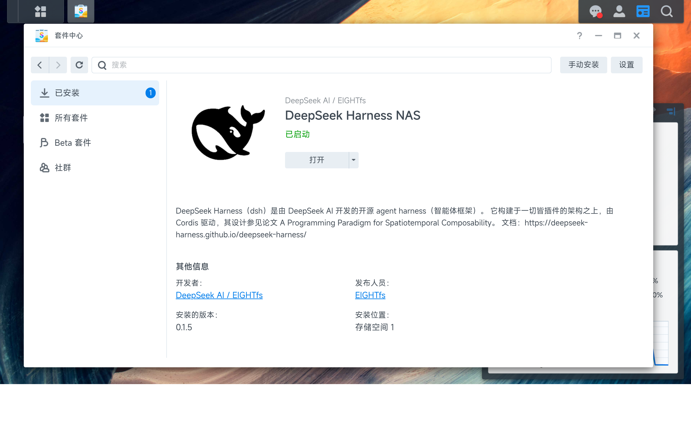
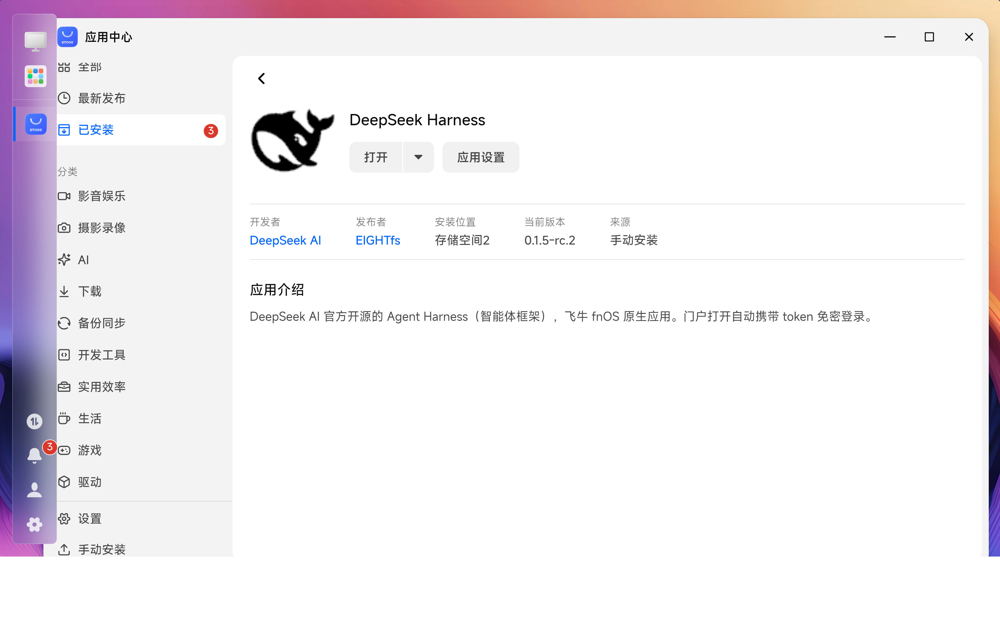
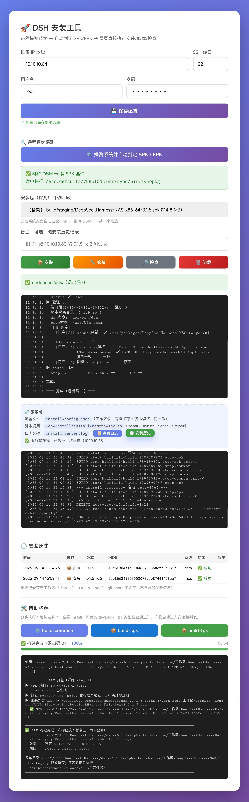

# DeepSeekHarness-NAS

> DeepSeek Harness 的群晖 DSM (.spk) / 飞牛 fnOS (.fpk) 平台适配包 — NAS 原生运行 DeepSeek Harness，无需 Docker

<p align="center">
  
</p>

[](https://opensource.org/licenses/MIT)
[](https://www.synology.com)
[](https://www.flywrc.com)

## 📦 简介

DeepSeek Harness (DSH) 是 DeepSeek AI 官方开源的 Agent 框架，提供 Web UI 管理界面，支持多模型配置、自定义 OpenAI 兼容端点。本仓库提供群晖 DSM (.spk) 与飞牛 fnOS (.fpk) 两个 NAS 平台的适配版本。

当前基线：**dsh 官方 0.1.5-alpha.1**，品牌为 **DeepSeekHarness-NAS**（侧栏 + 浏览器标题）。

### 功能特性

- 🤖 **多模型支持** — DeepSeek 官方模型 + 自定义 OpenAI 兼容端点
- 🔌 **反向代理** — 内置透明反向代理（群晖 30800 → 内部 30801，飞牛 3080 → 内部 3081）
- 🛡️ **局域网限制** — 只放行私网 IP 段（127/10/172.16-31/192.168/169.254/0.x/fe80:/fc/fd），公网 IP 访问一律 403 中文提示页
- 🔐 **门户免密登录** — 群晖 Web（DSM 桌面/应用中心）打开套件入口时才携带 token（类似 Iventoy 的「打开」）：带过 token 后，浏览器局域网直接访问即免密；反之从未在网页端带过 token 的直接访问，因没有访问凭证而无法进入
- ⚙️ **Web UI** — 可视化模型管理和配置
- 🛡️ **安全模式** — DSH 启动失败时可一键禁用所有用户插件
- 🚀 **自动隐藏 token** — token 仅短暂出现在 URL 中，dsh 认证后自动收敛为干净地址
- 📝 **代理日志** — 每次请求记录 REQ/RESP 到 `/tmp/dsh-proxy.log`，便于排查

---

## 🚀 编译打包脚本

打包拆成几个脚本：**公共预编译只做一次**（`build/build-common.sh`），SPK / FPK 各自独立打包（`build/SPK/build-spk.sh`、`build/FPK/build-fpk.sh`），FPK 另有 npm 链路脚本（`build/FPK/build-npm-fpk-app.sh`）。发版走 **GitHub Actions 自动构建**（tag 推送即出 spk+fpk 双产物），本地脚本用于开发调试与手工兜底。

### 本地构建（等效 CI）

```bash
# 公共预编译：拉官方最新源 → pnpm install + build + 裁剪 → target
./build/build-common.sh

# 打 SPK（消费 target → build/staging/<APP_NAME>_x86_64-<版本>.spk）
./build/SPK/build-spk.sh

# 打 FPK 源码链路（消费 target → build/staging/<APP_NAME>_x86-<版本>.fpk）
./build/FPK/build-fpk.sh

# 打 FPK npm 链路（可选：npm 装官方包，免源码编译，体积更小）
./build/FPK/build-npm-fpk-app.sh        # 先装官方包生成 app_root
./build/FPK/build-fpk.sh --npm          # 再打 FPK（--npm 消费 app_root）
```

### 全部脚本一览

| 脚本 | 作用 | 参数 / 示例 |
|------|------|-------------|
| `build/build-common.sh` | **公共预编译**：install 前白名单裁剪 devDeps + pnpm install + pnpm build + 纯白名单裁剪 → `target` 整树 + `build-meta.env`（输出 `build/master-build/build-<版本>/`） | `[SRC] [SKIP_BUILD]`；`./build/build-common.sh "" 1` = 复用已有 target 秒级重打包 |
| `build/gen-prune-whitelist.sh` | **白名单自动生成**：从 npm 链路 `package-lock.json` 的 packages 键解析包名全集（排除平台变体/claude/codex），写入白名单 `lockfileDeps` 字段（源码构建裁剪用）；只动 `lockfileDeps` 键，**不覆盖手动 `extra`** | `[锁文件]` / `--dry-run`；`./build/gen-prune-whitelist.sh` = 自动找最新锁文件更新白名单 |
| `build/prune-target.sh` | **纯白名单裁剪（独立可跑，双模式）**：`--before-install <BUILD_SRC>` 在 install 前剥离非白名单 devDeps（省 install 磁盘峰值，防 CI 撑爆 runner；构建必需工具已手动追加白名单 extra）；默认模式对已构建 target 裁剪（不在 lockfileDeps+workspaceRuntimeDeps 的一律删 + force_exclude codex/claude/linuxmusl），白名单更新后可单独重裁 target 免重编译 | `--before-install <BUILD_SRC>` 或 `<TARGET> [WHITELIST]`；`./build/prune-target.sh --before-install build/master-build/build-0.1.5/source` |
| `build/FPK/build-npm-fpk-app.sh` | **FPK npm 链路（可选）**：npm 装官方包（`--omit=dev`）→ `build/master-build/npm-app-<版本>/app_root`（免源码编译） | `[VERSION]`；`./build/FPK/build-npm-fpk-app.sh 0.1.5-rc.2`（幂等，重跑秒级） |
| `build/SPK/build-spk.sh` | 消费 target → 群晖 `.spk`（端口 30800/30801/30802） | 无参数；`./build/SPK/build-spk.sh` → `build/staging/<APP_NAME>_x86_64-<版本>.spk` |
| `build/FPK/build-fpk.sh` | 消费 target → 飞牛 `.fpk`（端口 3080/3081/3082）；`--npm` 消费 npm 链路 app_root（双链路并存） | `[--npm]`；`./build/FPK/build-fpk.sh --npm` → `build/staging/<APP_NAME>_x86-<版本>.fpk` |
| `build/build-test-fpk.sh` | 构建**测试版** FPK（调试用，含版本标记） | 无参数 |
| `scripts/fetch-dsh-latest.sh` | 一键拉取 **DSH 官方最新版源码**到 `src/deepseek-ai/<tag>`（自动识别 tag） | `./scripts/fetch-dsh-latest.sh` |
| `scripts/promote-release.sh` | **发布提升**：验证通过的 `build/staging/` 产物 → `release/` | `D_REL=<dir>` 覆盖输出目录 |
| `web-install/install-remote-spk.sh` | **远程安装工具（群晖 DSM 专用）**：网页/SSH 远端装 spk（install/uninstall/check 三合一，root 补建软链） | 读 `install-config.json`（host/user/password/spk 路径） |
| `web-install/install-remote-fpk.sh` | **远程安装工具（飞牛 fnOS 专用）**：独立副本只做 fpk——install/uninstall/check + 安装后 root 补建 dsh/pnpm 软链（fnOS 生命周期钩子以应用用户执行，写不了系统 PATH，实测 uid=964） | 读 `install-config.json`（host/user/password/fpk 路径） |
| `web-install/install-server.py` | **网页安装服务端**：配置保存 + 系统探测 + 远程执行 + **安装历史**（版本+MD5+时间+结果+备注） | 端口 8765，配 `install.html` 前端；历史落盘 `install-tasks.jsonl`（gitignore 不入库） |
| `web-install/install-server-ctl.sh` | 8765 安装工具服务端启停脚本 | `start/stop/restart/status` |
| `web-install/clean-dsm-residue.sh` | DSM 卸载残留清理（包数据库/目录/systemd 缓存） | 远程执行 |
| `scripts/set-dsh-cpu-quota.sh` | 设置 DSH CPU 配额（cgroup 限制） | `./scripts/set-dsh-cpu-quota.sh` |
| `scripts/verify-dsh-cpu-quota.sh` | 验证 DSH CPU 配额是否生效 | 无参数 |
| `scripts/fix-dsh-settings-namespace.sh` | 修复 DSH alpha 版插件加载失败（`settingsNamespace` 缺失） | 幂等，含备份 |
| `scripts/generate-diff-report.sh` | 差分报告：对比正式版 / 测试版 FPK 差异 | 无参数 |
| `scripts/first-build-logic.sh` | 「首启构建」逻辑留档（从 start.sh 抽离，实际打包不再使用） | 仅文档 |
| `scripts/dsh` | **dsh CLI 包装器**：SSH 敲 `dsh` 直接用 DSH CLI（readlink 软链解析，多入口自适应） | 打进包 `bin/dsh` |
| `scripts/pnpm` | **pnpm 命令包装器**：随包 node 跑 pnpm.mjs（软链解析，路径与包名无关） | 打进包 `bin/pnpm` |

### 手工构建示例（开发调试用）

```bash
# ① 公共预编译（只跑一次，产出 target；全量约 15-20 分钟）
./build/build-common.sh                        # 全量：扫描源码 → install + build + 裁剪
./build/build-common.sh "" 1                   # 复用已有 target（跳过编译，秒级）

# ② 打包（消费 ① 的 target；无参数，配置读 build-config.yaml）
./build/SPK/build-spk.sh                       # → build/staging/<APP_NAME>_x86_64-<SPK版本>.spk
./build/FPK/build-fpk.sh                       # → build/staging/<APP_NAME>_x86-<FPK版本>.fpk

# ②' FPK npm 链路（可选）：npm 装官方包，无需源码编译
./build/FPK/build-npm-fpk-app.sh 0.1.5-rc.2    # 下载 node + npm install 官方包（幂等）
./build/FPK/build-fpk.sh --npm                 # 消费 npm app_root → 同路径 fpk
```

**参数与配置来源**（已精简，去掉「套件类型 / 套件说明 / 品牌名」三个参数）：

> 🎯 **FPK 双链路实测结论（2026-09-13 dsh 0.1.5-rc.2）**：**只推荐 npm 链路发版**。
> - **npm 链路**（`--npm`，官方 npm 包）：fpk **94M**，应用体解压 387M，`node_modules` 扁平无嵌套、`dsh-tools` 单副本（运行时 Symbol 唯一，无 `reading 'prepare'` 崩溃）、软链仅 10 条 → **实机安装 running，三端口在听**。
> - **源码编译链路**（默认，build-common.sh target）：fpk 173M，应用体解压 807M，`node_modules` 为 pnpm workspace 布局 → 软链 **6703 条** → **实机安装即 fail `10234`**（app.tgz 含软链，fnOS 后端 ACL `acl_get_file` 失败；每次全新态复位验证均为同一结果）。要源码化必须重写打包排除软链并验证运行时依赖完整，当前不做。
> - 体积基线：npm 链路 94M ≈ 100MiB 目标 ✅；源码链路 173M 超出 100MiB（未裁剪）。

- `SRC` 源码目录：缺省通配扫描 `src/deepseek-ai/*`（不硬编码版本目录名），其次 `build/master-build/master-build`
- `SKIP_BUILD`：`1` = 复用已有 target（快速重打包），缺省 `0` = 全量构建
- **套件说明 / 品牌名 / 端口**：不走命令行参数，统一读 `build/build-config.yaml`（`defaults` + `spk:` / `fpk:` 段），单一真源
- **版本号**：从源码 `package.json` 自动读取（SPK 取前三位 `0.1.5`，FPK 取完整 `0.1.5-rc.2`）
- **元数据传递**：`build-common.sh` 写 `build/master-build/build-<版本>/build-meta.env`，两个打包脚本 `source` 它（避免各脚本重复推导版本/名字/描述）
- **环境变量覆盖**：`APP_NAME` / `D_SRC` / `D_BUILD` / `D_STAGING` / `D_ASSETS` / `D_SCRIPTS` 可临时覆盖（换名实验、目录迁移）

> **打包模式**：唯一模式 = 预构建产物包（装完即用，无首启构建）。
> 原「精简包首启构建」逻辑（`ensure_built` + 构建进度占位页）已抽离留档，见 `scripts/first-build-logic.sh`（实际打包不再使用）。

产物统一输出到 `build/staging/`（验证后 `promote-release.sh` 提升到 `release/`，可用 `D_REL=<dir>` 覆盖）。**历史发布版已清理，今后发版统一走 GitHub Actions 自动构建**（见下文「自动构建」）。

脚本自动完成（★ 标注执行脚本）：

- **品牌修改** ★`build-common.sh`：locale 内 `DSH Local Build` → `DeepSeekHarness-NAS`（en/zh）+ 构建后 html title 兜底
- **小字完整版本号** ★`build-common.sh`：构建注入 `DSH_CLIENT_VERSION` / `DSH_CLIENT_COMMIT_HASH` / `DSH_CLIENT_TITLE`，界面显示 `<官方版本>-<commit>[-dirty]`（与官方版本同步）
- **SPK 版本号** ★`build-spk.sh` = 官方版本前三位（`0.1.5-alpha.1` → `0.1.5`），无 build 后缀，同版本安装直接覆盖
- **门户资源** ★`build-spk.sh` / `build-fpk.sh`：`ui/` + `spk-templates/ui-config.json` 打进 package.tgz，DSM 安装时自动建 `webman/3rdparty/deepseek-harness-nas` 链接，桌面出现套件图标

### GitHub Actions 自动构建（发版走这里）

```yaml
# .github/workflows/build.yml —— 触发: 定时(每日04:00 UTC) / workflow_dispatch(手动) / tag推送
# jobs: build-spk（源码链路）∥ build-fpk（npm 链路）→ release（自动发布，与官方同 tag）
# 产物命名: <APP_NAME>_<平台>-<版本>.<spk|fpk>
```

- 触发：①每日 04:00 UTC（北京 12:00）定时自动拉官方最新源并构建；②Actions 页手动 `workflow_dispatch`；③推送 tag（`v0.1.5` 等）
- **fpk/spk 构建开关（2026-09-14）**：build.yml 顶部 `env.BUILD_FPK` / `env.BUILD_SPK` 分别控制两个产物是否构建（`'true'` 构建 / `'false'` 跳过），临时只测 spk 可把 `BUILD_FPK` 改 `false`；Release 说明会标注 `⏭️ 跳过`
- **自动发布（与官方同 tag）**：三个触发方式都会自动建/更新 Release——tag 名取官方最新 dsh tag（`scripts/fetch-dsh-latest.sh --print-tag` 解析，如 `dsh-v0.1.5-rc.2`），同名 Release 已存在则**覆盖资产**（滚动刷新），不存在则自动创建；含 `-`（rc/alpha）的 tag 自动标 prerelease
- **部分失败容忍**：`release` job 用 `always()`，源码链路 SPK 失败时仍发布 FPK，并在 Release 说明中标注 `SPK: ❌ 缺失`（实测 run #6：`dsh-v0.1.5-rc.2 自动构建` 已发布，含 FPK 93MB）
- 产物同时上传 artifact（`spk-dist` / `fpk-dist`，保留 14 天）；构建失败时额外上传 `build-spk-debug-log`（完整 `pnpm-build.log`，因 GitHub 偶尔不归档该 job 日志）
- **公共预编译单步（2026-09-14 后合并，2026-09-15 定稿）**：最初为定位死点拆过 `BUILD_STAGE`（`install`/`build`/`prune`）三步，但拆步后 step 被 OOM/磁盘杀时结论 `None` 不触发 `if: failure()`，日志 blob 又常丢失 → 排查不出去向。定稿：**CI 单步 `./build/build-common.sh`（默认 `BUILD_STAGE=all`）**，失败时 `failure()` 捕获 + artifact 兜底完整 `pnpm-build.log`
- **install 前白名单裁剪（2026-09-14，SPK CI 磁盘爆盘修复）**：annotation 实测根因 = `pnpm install/build` 阶段把 runner 磁盘写满（`No space left on device` → worker 被杀 → step 永久 in_progress）。官方 monorepo 依赖树约 1.78 万包，install 阶段下载全部 devDeps（vitest/jsdom/mermaid 等巨大传递依赖）拉满磁盘峰值。修复：`prune-target.sh --before-install` 在 `pnpm install` **前**用纯白名单剥离根 package.json 中**非白名单 devDeps**，install 不再下载它们；构建必需工具（typescript/tsx/tsdown/lightningcss/execa/smol-toml）手动追加进白名单 `extra`（`gen-prune-whitelist.sh` 自动生成只动 `lockfileDeps`，不覆盖手动部分），install 保留、build 不裂
- 本地等效：按「本地构建」段落逐脚本跑（同一套 fetch → build → 打包 流程）

### 打包模式：预构建产物包（唯一模式）

| 类型 | 产物文件 | 说明 |
|------|----------|------|
| SPK | `build/staging/<APP_NAME>_x86_64-<SPK版本>.spk` | 预构建产物包：本地构建产物 + 裁剪后 node_modules，装完即用 |
| FPK | `build/staging/<APP_NAME>_x86-<FPK版本>.fpk` | 同上（手动 tar+gzip；app.tgz 与外层均无 `./` 前缀） |

> **裁剪（有依据，非盲删）**：①非 linux-x64 平台变体（darwin/win32/arm/musl/ia32…）；②**devDependencies 及其传递依赖**（清单从根 `package.json` 动态读取，不硬编码——已实测删后 `dsh --version` 与 web HTTP 200 正常）；③claude-agent-sdk/codex（体积大头，明确不需要）；④`packages|apps` 的 src（构建产物在 lib/dist）+ docs/benchmarks/native。保留：`bin/node` + `bin/dsh` + `bin/pnpm` + 随包 pnpm + 各包 lib/dist 产物 + 运行时 node_modules。
>
> **白名单自动生成（2026-09-13）**：`build/gen-prune-whitelist.sh` 从 npm 链路 `package-lock.json` 的 packages 键解析包名全集（实测磁盘实际包 522 个全部落在锁文件 582 条引用内，0 误删）→ 写入白名单 `lockfileDeps` 字段（排除平台变体/claude/codex 后 489 个）；与 `extra` + `workspaceRuntimeDeps`（动态收集 target/packages 的 dependencies）取并集，黑名单候选命中即保护。裁剪逻辑独立为 `build/prune-target.sh`，可单独对已有 target 重跑（白名单更新后免重编译）。
>
> **官方依赖表（裁剪依据，来源 dsh 官方 requirements）**：

| 依赖类别 | 具体项 | 是否必需 |
|---|---|---|
| 核心运行时 | Node.js ^22.19.0 或 >=24.0.0 | ✅ 必需 |
| 原生模块 | node-pty, sharp, koffi, esbuild, ripgrep | ✅ 随 npm 安装（**不能裁**，裁剪后已验证完好） |
| 系统库 (Linux) | libc6 (GLIBC)，版本因架构而异 | ✅ 必需 |
| 构建工具 (源码) | pnpm 11.7.0, Git 2.26+, Python 3.10+, C++ 工具链 | 仅源码安装需要（预构建包**不需要**，devDeps 裁剪即依据此条） |
| 可选 | Python 3.10+ (SDK), Docker, 浏览器 | 按需 |

> **验收标准**：安装后能启动、30800 端口可达、门户免密跳转正常、`dsh`/`pnpm` 命令可用。

### 构建产物

| 产物 | 说明 |
|------|------|
| `DeepSeekHarness-x86_64-0.1.5.spk` | 群晖 DSM 套件包（内嵌 node + dsh 0.1.5-alpha.1 全量编译） |

---

## 🔌 三端口说明（一套应用、三个入口）

每个平台都用 **1 个反代端口 + 1 个 DSH 原生端口 + 1 个容器页面端口**。DSH 原生服务只监听 `127.0.0.1`，对外一律走反代端口（带门户认证 / 局域网白名单）。

| 端口 | 监听 | 作用 | 访问方式 |
|------|------|------|----------|
| **3080**（fpk）/ **30800**（spk） | `0.0.0.0` | **反代端口**：用户唯一入口。套件门户打开自动带 token 免密；局域网直连 403；认证后免密；公网 IP 一律 403 | 浏览器 `http://<NAS-IP>:3080` |
| **3081**（fpk）/ **30801**（spk） | `127.0.0.1` | **DSH 原生端口**：dsh web 服务本体，仅本机可访问（安全边界） | 本机 `curl 127.0.0.1:3081` |
| **3082**（fpk）/ **30802**（spk） | `0.0.0.0` | **容器页面端口**：dsh-repair 守护的容器管理页，同反代策略（局域网放行 / 公网 403） | 浏览器 `http://<NAS-IP>:3082` |

```
 浏览器/门户
     │ 3080 (0.0.0.0)
     ▼
 反代 (Node http.createServer)
     ├─ ⓪ 局域网硬闸 isLoopbackOrLan(ip) —— 公网 IP → 403 中文提示页
     ├─ ① 门户来源（无 cookie）→ 302 ?token= 免密认证
     ├─ ② 已持 dsh-auth cookie → 透明放行（带过 token 即免密）
     └─ ③ 直连（Sec-Fetch-Site:none / 异主机 Referer）→ 403「请从套件图标打开」
        │
        ▼ 127.0.0.1:3081
     DSH web（dsh web 原生端口，仅本机）
```

- **端口不写死**：脚本/代码一律调 `read_ports <system>` 读 `build/build-config.yaml`（`defaults` / `spk:` / `fpk:` 三段），禁止出现端口字面量
- **双平台并存**：spk 用 30800 段、fpk 用 3080 段，互不冲突，可同机共存
- **命令行自定义**：`./start.sh --proxy-port N --dsh-port N --container-port N start`

---

## ⚙️ start.sh 功能详解

`build/start.sh.example` 是 SPK/FPK 运行脚本的**唯一母版**（调 `__PROXY_PORT__` / `__DSH_PORT__` / `__CONTAINER_PORT__` 等占位符，打包脚本按平台替换为最终 `bin/start.sh`，一个母版双平台复用）。功能清单：

### 1. 服务生命周期（start/stop/restart/status）

```bash
./start.sh start          # 启动：找 DSH → 起 dsh web → 起反代 → 起容器守护 → 校验三端口
./start.sh stop           # 停止：PID 精确终止（先 TERM 后 KILL），清端口
./start.sh restart        # 重启：stop + start（未启动时相当于 start）
./start.sh status         # 状态：DSH 进程存活 + 三端口监听检查，退出码 0/3（供外部判活）
```

- **cmd_status 返回退出码**（0=运行中 / 3=未运行），供 fnOS/DSM 判活；运行检测 `pgrep -f "<绝对路径>/bin/start.sh"` 精确匹配，避免宽松匹配误判
- **PID 文件禁放 /tmp**（fnOS `/tmp` 无 sticky 位，应用用户无权限）→ 移入 `$DSH_HOME_PARENT/DeepSeekHarness-NAS.pid`

### 2. 实例定位（多布局自适应）

`find_dsh_dir()` + `detect_entry()` 按顺序探测实例入口：

```
① node_modules/@deepseek-ai/dsh/lib/bin.js   ← npm 链路（build-npm-fpk-app.sh 产物）
② apps/cli/lib/bin.js                        ← 官方源码编译产物（build-common.sh 产物）
③ lib/bin.js                                 ← 兜底
```

- `find_node()` 依次找 `bin/node`（随包）→ `/usr/local/bin/node` → `/usr/bin/node` → PATH（不硬编码第三方套件路径）
- `resolve_pkg_version()` 版本优先级：dsh 包 version → npm 产物 localBuildVersion → 顶层 package.json（打包期也注入兜底值）

### 3. 品牌与版本名牌（网页左上角）

- `BRAND_NAME` = `DeepSeekHarness-NAS`（侧栏 + 浏览器标题 + 网页左上角）
- 小字版本号显示 `<官方版本>-<commit>[-dirty]`，与官方版本同步（`DSH_CLIENT_VERSION` / `DSH_CLIENT_COMMIT_HASH` / `DSH_CLIENT_TITLE` 注入）

### 4. 反代：门户免密 + 局域网硬闸 + 直连 403

请求处理顺序（`proxyServer` 回调）：

```
⓪ 局域网硬闸  isLoopbackOrLan(req.socket.remoteAddress)
     不是 127/10/172.16-31/192.168/169.254/0.x/fe80:/fc::/fd:: 私有段 → 403 中文提示页
① 已持 dsh-auth cookie → 透明放行（带过 token 即免密，直连也放行）
② 门户打开（cross-site + 同主机 Referer / iframe / 无 Referer）→ 302 ?token= 自动认证
③ 地址栏直连（Sec-Fetch-Site: none / 异主机 Referer）→ 403「请从套件图标打开」
```

- **门户免密原理**：套件桌面图标打开（DSM https:5001 → http:30800 / fnOS 应用 iframe）请求特征 = `cross-site` + 同主机 Referer → 反代 302 无条件带 `?token=`；dsh 认证后 303 收敛干净 URL 并种 `dsh-auth` cookie；此后浏览器直连即免密
- **直连 403**：地址栏直接访问（`Sec-Fetch-Site: none`）因为从未经过门户带 token、无访问凭证 → 403 提示「请从套件图标打开」，页面内 XHR/WS 一律放行（只对文档级导航设卡）
- **局域网限制（2026-09-13 新增）**：只放行私网 IP 段，公网/外网 IP 访问 → 403 中文提示页（`LAN_ONLY_PAGE`）——「只能局域网访问」的最终防线，先于一切认证逻辑
- **SameSite=Strict → Lax 改写**：跨 scheme（DSM https→http）cookie 不被丢弃，防 ERR_TOO_MANY_REDIRECTS
- **代理日志**：每次请求 REQ/RESP 记到 `$DSH_HOME_PARENT/dsh-proxy.log`（含 cookie 前缀，可确认 token 跳转链路）

### 5. 容器页面（3082）

`containerServer` 与反代同策略：局域网放行 + 公网 IP 403 + 门户免密。DSH 内部容器/子服务管理页（dsh-repair 守护，端口 `DSH_REPAIR_CONTAINER_PORT`）。

### 6. 端口与 token

- 启动时自动生成 token：`http://<NAS-IP>:<反代端口>/?token=...`（token 仅短暂出现在 URL，认证后自动收敛）
- 运行检测通过才报启动成功（rc=0），三端口校验（DSH=3081 / 反代=3080 / 容器=3082）

---

## 🚀 安装与访问

> 截图（DSH 网页主界面——安装后门户打开即进入）：

> 

### 群晖 DSM（.spk）

> 截图（DSM 门户打开套件 → 自动带 token 进入）：

> 

```bash
# 前置条件：DSM 7.2+，x86_64 架构（已内置 node，无需额外安装）
# Package Center → 手动安装 → 选择 .spk
```

- Web 入口：DSM 桌面套件图标（网页端打开＝携带 token 的第一步），或访问 `http://<NAS-IP>:30800`
- **门户免密原理（权威设计·禁止改动，参考 SA6400 Iventoy 套件「打开」机制）**：
  1. **群晖 Web 打开才带 token** — DSM 网页（桌面套件图标 / 应用中心）打开套件入口时，浏览器请求才携带 token（同 aria2 / Iventoy 等套件的「打开」方式）；**直接地址栏访问 `http://<NAS-IP>:30800` 不携带 token**；
  2. **带过 token，局域网访问就不用带 token** — 首次经网页端带 token 打开后，浏览器已有访问凭证（会话 cookie），此后直接访问 `http://<NAS-IP>:30800` 即免密；
  3. **反之，Web 没打开过（没带过 token）的直接访问，因为没有带过 token 而无法访问** — 未从网页端建立过凭证的请求不会放行。
  - **实现落点**（`build/start.sh.example` 反代段 + 打包脚本 gen_start_sh / gen-portal）：入口收敛 `isDirectAccess()` 判定 + 门户打开时自动 `302 ?token=` 完成认证（认证后 303 收敛干净 URL）；`SameSite=Strict → Lax` 改写解决跨 scheme cookie 丢弃；401 兜底自动重认证。
  - **禁止**：反代不得对「无访问凭证的任意请求」无条件附加 token（会破坏第 3 条，等于开放无鉴权访问）；不得删除 `isDirectAccess()` 入口收敛（否则直连也免密）。
  - **入口收敛判定**（`build/start.sh.example`，实测 2026-09-13 VirtualDSM 0.1.5）：只对文档级导航（`Sec-Fetch-Dest: document/iframe/frame`）设卡，页面内 XHR/WS 一律放行；`Sec-Fetch-Site: none` = 地址栏直连 → 403；无 `Sec-Fetch-*` 头（旧 WebView）退化为 Referer 同主机判定；`cross-site` 且异主机 Referer = 外站跳入 → 403；DSM 门户 https:5001 → http:30800（同主机跨 scheme）与 fnOS 门户 iframe 均放行 → 302 带 token；已持 `dsh-auth` cookie → 无条件放行。
  - **验收标准（7 场景实测清单，2026-09-13 193 VirtualDSM 卸载重装全过）**：

| # | 场景 | 请求特征 | 预期 | 实测 |
|---|---|---|---|---|
| 1 | 地址栏直连 | `Sec-Fetch-Site: none` | 403「请从套件图标打开」 | ✅ 403 |
| 2 | DSM 门户打开 | `cross-site` + 同主机 Referer | 302 → `?token=` | ✅ 302 |
| 3 | DSM 门户 Referer 被剥 | `cross-site` 无 Referer | 302 → `?token=` | ✅ 302 |
| 4 | 外站链接跳入 | `cross-site` + 异主机 Referer | 403 | ✅ 403 |
| 5 | 带 token 认证 | `?token=` 访问 | 303 收敛 + 种 `dsh-auth` cookie | ✅ 303+cookie |
| 6 | 认证后直连 | 带 cookie + `none` | 200 免密 | ✅ 200 |
| 7 | HTML polyfill 注入 | 认证后页面 | 含 `randomUUID`/`ownsHost` polyfill | ✅ 10 处 |
- **支持命令行 dsh** — 套件安装/修复后自动建立 `/usr/bin/dsh` 软链，SSH 登录 NAS 后直接敲 `dsh` 即可使用 DSH CLI（无需进入套件目录）。**软链三通道**（实测 DSM 7.4.1 安装时不执行 installer hooks，单靠 postinst 会失效）：
  1. **installer 三 hook** — postinst / prereplace / postreplace / postupgrade 统一走 `setup_pkg_env`（建版本目录 + chown + 建软链），DSM 走脚本管理路径时生效；
  2. **远程安装 root 补建** — `install-remote-spk.sh`（网页安装/修复同源）装完以 root `ln -sf` 补建 `/usr/bin/dsh`（本次实测生效，最可靠通道）；
  3. **start.sh cmd_start 运行时自愈** — 启动时幂等重建软链，fallback 链 `/usr/bin` → `/usr/local/bin` → `$HOME/.local/bin`（先 `mkdir -p` 父目录；DSM 服务以套件用户运行，系统目录不可写时落到套件 HOME）
- 数据目录：`/var/packages/DeepSeekHarness-NAS/target/var/data` 与 `.dsh-home/.dsh`

### 飞牛 fnOS（.fpk)

> 截图（fnOS 应用中心登录页）：

> 

> 打包与错误码速查固化在 skill：`fnos-fpk-package-guide`（见技能仓库 `ai-work-archive/skills/execution-执行/`）——官方 fnpack、手动 tar+gzip 兜底、manifest 字段（**禁止 changelog 字段**，实测触发 10111）、CPU 配额/共存部署/污染防再犯均在；`fnos-fpk-error-table` 为安装错误码速查表。fpk 应用体与 spk 同源（官方 dsh 版本），门户打开自动带 token，机制与 spk 相同。

---

## 🖥 网页安装工具（远程探测 + 一键安装）

浏览器访问安装网页（本机局域网地址 + 端口 8765，`web-install/install-server-ctl.sh start` 启动），远程安装 spk/fpk：

| 能力 | 说明 |
|------|------|
| 🔍 探测系统 | 填 IP/端口/账号密码 → 一键探测远端是 群晖 DSM 还是 飞牛 fnOS → **自动判定 SPK / FPK** |
| 📦 安装包匹配 | 扫描 `build/staging/` 与 `release/`（含 `release/<tag>/` 子目录，自动同步落位的包）→ 探测后自动切到对应类型候选，显示来源相对路径 |
| 📦 安装 / 🔧 修复 / 🔎 检查 / 🗑 卸载 | 网页直接远程执行（走 `install-remote-spk.sh` / `install-remote-fpk.sh`，安装后 root 补建 `/usr/bin/dsh` 软链） |
| 🕘 安装历史 | 每次执行落盘 `install-tasks.jsonl`（时间/命令/包名/版本/MD5/系统/退出码/结果/备注），页面「安装历史」面板展示 |
| 💾 配置记忆 | 配置存 `web-install/install-config.json`（与脚本同目录，2026-09-15 归位）；再次打开网页自动回填全部字段（含密码），无需重填即可直接探测/安装 |

> 截图（安装网页首页）：
>
> 

## 🗂 配置文件设计（远程安装工具）

> 配置设计逻辑（2026-09-11 确立），约束 `install-server.py` / `install-remote-spk.sh` / `build/build-common.sh`+`build-spk.sh`+`build-fpk.sh` 的配置来源，**禁止在代码中写死任何端口或路径**。

### 职责分离：两份配置文件

| 文件 | 位置 | 职责 | 谁写 | 谁读 |
|------|------|------|------|------|
| `install-config.json` | `web-install/`（与脚本同目录） | **连接配置**：目标主机/端口/用户名/密码/包路径 | 网页 `POST /api/save`（install-server.py） | install-server.py、install-remote-spk.sh |
| `build-config.yaml` | `build/`（脚本同级） | **打包与端口权威配置**：defaults/spk/fpk 三段 | 手动维护 | build-spk.sh / build-fpk.sh（各自生成 start.sh 注入本平台端口段）、install-remote-spk.sh（读端口段） |

### install-config.json（网页保存的连接配置）

```json
{
  "host": "192.168.1.100",
  "port": "22",
  "username": "admin",
  "password": "***",
  "system": "dsm",
  "fpk": "/path/to/xxx.fpk",
  "saved_at": "2026-09-10T00:52:05.537Z"
}
```

- 单一来源铁律：**必须与脚本同目录**（`web-install/`，install-remote-spk.sh 读 `$WS/install-config.json`），禁止网页把配置写到别的目录——否则脚本读不到。
- 网页保存时密码留空 = 沿用已保存密码（回显占位「留空沿用」）。
- `system` 字段由网页「探测系统」成功后写入（dsm/fnos），供远程脚本选分支。

### build-config.yaml（端口权威配置，禁止写死）

```yaml
defaults:
  proxy_port: 3080        # fpk 默认段
  dsh_port: 3081
  container_port: 3082
spk:
  proxy_port: 30800       # spk 覆盖（与 fpk 段隔离）
  dsh_port: 30801
  container_port: 30802
fpk:
  # 留空则沿用 defaults（3080 段）
```

- **端口不写死原则**：脚本/网页代码中禁止出现 `30800`/`3080` 等端口字面量；需要端口时调 `read_ports <system>`（install-remote-spk.sh 内嵌，PyYAML 解析 build-config.yaml）按分支读取。
- **端口段隔离**：spk 用 30800 段、fpk 用 3080 段，两者互不冲突，可同时运行（双实例共存）。

### system 推断链（install-remote-spk.sh）

```
system = 参数 > install-config.json 的 system > 包后缀（.fpk→fnos）> dsm（旧默认）
```

### spk/fpk 双分支（install-remote-spk.sh）

| 分支 | 安装 | 卸载 | 检查 |
|------|------|------|------|
| `dsm`（群晖） | `synopkg install` | `synopkg stop/uninstall` + clean-dsm-residue.sh | synopkg 状态 + 门户3文件 |
| `fnos`（飞牛） | `appcenter-cli install-fpk` | `appcenter-cli uninstall` | appcenter-cli 状态 + 端口 |

- 远程检查的端口、临时目录（如 DSM 的 /tmp 是 1.5G tmpfs）、门户路径全部按分支处理，**不共用一套写死值**。

### 端口探测特征（/api/detect 与 detect_remote）

| 系统 | 特征文件（存在即命中） |
|------|------------------------|
| 群晖 DSM | `/etc.defaults/VERSION`、`/usr/syno/bin/synopkg` |
| 飞牛 fnOS | `/usr/trim`、`/usr/local/bin/appcenter-cli`、`/usr/local/bin/fnpack` |

> 飞牛 os-release 伪装成 Debian，不能看 os-release，必须用上述特征文件判定。

---

## ⚙️ 配置自定义 API

1. 打开 Web UI（31800 门户或 `http://<NAS-IP>:30800`）
2. 进入 **设置 → Models**，点击「添加提供方」

配置文件位置：

- 群晖: `/var/packages/deepseek-harness-nas/target/var/data/.dsh/settings.yaml`
- 凭据: `/var/packages/deepseek-harness-nas/target/var/data/.dsh/.credentials.yaml`

```yaml
providers:
  agnes:
    id: agnes
    name: Agnes AI
    type: openai-completions
    base_url: https://api.agnes-ai.cn/v1
    models:
      - id: agnes-2.5-flash
        name: agnes-2.5-flash
      - id: agnes-2.5-pro
        name: agnes-2.5-pro
```

```yaml
API_KEYS:
  DEEPSEEK_API_KEY: "<填入你的API密钥>"  # dsh-skip-sensitive
```

| 提供商 | Base URL | 认证方式 |
|--------|----------|----------|
| DeepSeek 官方 | `https://api.deepseek.com/v1` | Bearer Token |
| Agnes AI | `https://api.agnes-ai.cn/v1` | Bearer Token |
| Ollama 本地 | `http://localhost:11434/v1` | 无需 Key |

---

## 📁 文件结构

工作区按**源码 / 构建物 / 脚本 / 文档 / 发布物**五类归置，根目录只保留打包入口：

```
DeepSeekHarness-NAS/
├── README.md
├── build/build-config.yaml       # 打包配置（appname/端口/分类目录）
├── src/                          # 【源码】
│   └── deepseek-ai/              #   官方源码快照（打包源）
├── assets/                       # 【临时素材】pnpm-store/cache 等
├── build/                        # 【构建物 + 复用素材】
│   ├── build-common.sh           #   公共预编译（通用，独一：install+build+裁剪 → target）
│   ├── prune-target.sh           #   纯白名单裁剪（通用，独立可跑）
│   ├── gen-prune-whitelist.sh    #   白名单自动生成（通用）
│   ├── simulate-cleanup.py       #   裁剪模拟器（通用，预览不删）
│   ├── SPK/
│   │   └── build-spk.sh          #   SPK 打包（消费 target → 群晖 .spk）
│   ├── FPK/
│   │   ├── build-fpk.sh          #   FPK 打包（消费 target 或 --npm 消费 app_root）
│   │   └── build-npm-fpk-app.sh  #   FPK npm 链路应用体构建（免源码编译）
│   ├── build-test-fpk.sh         #   测试版 FPK 构建
│   ├── start.sh.example          #   SPK/FPK 运行模板母版（唯一权威，打包脚本注入端口生成最终 start.sh）
│   ├── build-config.yaml         #   打包与端口权威配置（defaults/spk/fpk 三段）
│   ├── build-excludes.json       #   tar 排除规则（dist 模式）
│   ├── build-prune-whitelist.json#   裁剪白名单（lockfileDeps + extra + workspaceRuntimeDeps）
│   ├── conf/                     #   权限/资源声明（privilege/resource）
│   ├── ui/images/                #   门户图标
│   ├── PACKAGE_ICON*.PNG         #   套件图标
│   ├── staging/                  #   打包输出暂存区（.spk/.fpk）
│   └── master-build/             #   构建中间产物根（build-*/ 源码 target + npm-app-*/ npm 链路，git 黑名单）
├── scripts/                      # 【脚本】
│   ├── fetch-dsh-latest.sh      #   拉官方最新源码 → src/deepseek-ai/<tag>
│   ├── dsh                      #   dsh CLI 包装器（readlink 软链解析）
│   ├── pnpm                     #   pnpm 命令包装器（随包 pnpm 软链目标）
│   ├── promote-release.sh       #   发布提升（staging → release/）
│   ├── set-dsh-cpu-quota.sh / verify-dsh-cpu-quota.sh  # CPU 配额设置/验证
│   ├── fix-dsh-settings-namespace.sh  # alpha 版插件加载失败修复
│   ├── generate-diff-report.sh  #   正式/测试 FPK 差分报告
│   └── dsh-repair.cjs           #   独立守护
├── web-install/                 # 【网页安装工具】远程探测系统 + 网页安装/卸载/检查/修复（2026-09-14 从 scripts/ 迁出）
│   ├── install-server.py        #   网页安装服务端（配置保存 + 系统探测 + 远程执行 + 安装历史）
│   ├── install-server-ctl.sh    #   8765 服务端启停（start/stop/restart/status）
│   ├── install.html             #   网页前端（自动判定 SPK/FPK 并直调脚本；含安装历史面板）
│   ├── install-remote-spk.sh    #   远程套件工具（群晖 DSM 双分支，install/uninstall/check/repair，root 补建软链）
│   ├── install-remote-fpk.sh    #   远程套件工具（飞牛 fnOS 专用，install/uninstall/check）
│   └── clean-dsm-residue.sh     #   DSM 卸载残留清理（远程执行）
├── docs/                        # 【文档】SPK-FPK 验收清单、打包开发文档
├── tools/pnpm                   #   项目自带 pnpm（构建/随包分发用，不用系统 pnpm）
├── release/                     # 【发布物】（历史发布版已清理，发版走 GitHub Actions）
├── tools/                       # 【工具】
│   ├── pnpm/                    #   pnpm 11.7.0（随包分发用）
│   ├── pnpm-bridge.py           #   pnpm 11 配置桥接器
│   └── fnpack                   #   飞牛官方 fpk 打包工具
└── docs/                        # 【文档】
    ├── publish/                 #   发布材料（应用信息汇总 + 截图）
    └── *.md                     #   开发文档
```

### 路径参数化

分类目录全部为变量，三级优先级：**命令行参数 > 环境变量 > config > 默认值**。

```bash
# 环境变量覆盖（优先级最高）
D_REL=/mnt/nas/release ./build/build-fpk.sh           # 发布物输出到别处
D_SRC=/other/src ./build/build-common.sh /other/src   # 换源码树

# config 覆盖（build-config.yaml → defaults.*_dir，相对脚本目录）
#   src_dir / assets_dir / build_dir / release_dir / tools_dir / scripts_dir
```

脚本启动时会自检分类目录并自动创建输出目录，路径写错会立即报错而非静默失败。

---

## 🐛 故障排除

### 浏览器 ERR_TOO_MANY_REDIRECTS

DSM 门户是 https（5001），套件是 http（30800）——**跨 scheme 携带 SameSite=Strict cookie 会被浏览器丢弃**，导致无限 302。SPK 内代理已把 dsh 响应的 `SameSite=Strict` 改写为 `SameSite=Lax` 修复。若仍出现，确认用的是最新 0.1.5.spk。

### DSM 桌面图标不出现 / 门户打不开

**根因：INFO `dsmappname` 与 `ui/config` 键名不一致**。DSM 要求两者逐字匹配，否则桌面图标点不开、套件中心无「打开」按钮。

| 文件 | 字段 | 要求 |
|------|------|------|
| INFO | `dsmappname="SYNO.SDS.XXX.Application"` | 去掉连字符（`DeepSeekHarness-NAS` → `DeepSeekHarnessNAS`） |
| ui/config | `.url."SYNO.SDS.XXX.Application"` | 必须与 INFO dsmappname **逐字一致** |
| ui/config | `protocol` + `port` | DSM 自动拼 NAS 真实 IP（不要用 `url: "http://localhost:..."`） |

**ui/config 正确格式**（DSM 自动拼地址，不写死 localhost/IP）：

```json
{
    ".url": {
        "SYNO.SDS.XXX.Application": {
            "type": "url",
            "protocol": "http",
            "port": "30800",
            "icon": "images/icon_{0}.png",
            "title": "显示名",
            "allUsers": false
        }
    }
}
```

**修复方式**：`scripts/start.sh.spk` 模板的 gen-portal 用 `__APP_ID__`（去连字符）而非 `__APP_NAME__`（带连字符）；打包脚本的 `gen_start_sh()` 通过 sed `__APP_ID__` → `APP_ID` 自动替换。

### synopkg error 263 / 313 安装失败

**263 "failed to create temp dir"**：上次卸载不干净，DSM 包数据库（`/var/cache/synopkg/installed/existence`）残留条目 → synopkg 把新安装当 repair → 找不到旧文件就 263。修复：`web-install/clean-dsm-residue.sh` 全面清理（目录 + systemd + 缓存 + samba + 用户组）。

**313 "failed to revise file attributes"**：SPK 内外层文件权限不对。DSM 要求标准 Unix 权限（目录755，文件644，脚本755），`0707` 权限会被拒。build-spk.sh / build-fpk.sh 已在 tar 前自动修正权限。

### pnpm store 只读分区问题

群晖 `/vol2` 根挂载为只读（ZFS），pnpm 全局 `storeDir` 指向该分区时 `pnpm install`/`pnpm build` 报 EROFS。修复：

- `pnpm install`：`--store-dir=<可写路径>`（CLI 最高优先级）
- `pnpm run build`：`HOME=<可写临时目录>`（绕过只读分区的全局 pnpm 配置）

build-common.sh 已自动处理（`$WS/assets/pnpm-store` + `$WS/assets/tmp-home`）。

### 平台裁剪（原生二进制瘦身）

pnpm 安装时会拉取**所有平台**的原生二进制包（esbuild/rolldown/oxlint/sharp/canvas 等），每个包有20+平台变体，总计 ~1.4GB。build-common.sh 在预编译阶段自动裁剪：

- **保留**：`linux-x64-gnu` / `linux-x64-musl`（NAS 目标平台）
- **删除**：darwin / win32 / linux-arm / linux-ppc / freebsd / android 等全部非 linux-x64 变体
- 裁剪后 .pnpm 从 ~2.3GB 降至 ~1GB

### 大小门禁

SPK 超过 500MB 自动报错退出，防止平台裁剪失败或意外大包（预构建包目标 ~200MB）。

### 端口冲突

默认 30800（代理）/ 30801（dsh）/ 30802（容器）。如需修改，编辑 `scripts/start.sh.spk` 顶部端口变量后重打包。

### 查看代理日志

```bash
tail -f /tmp/dsh-proxy.log   # 每行 REQ/RESP 含 cookie 前缀，可确认 token 跳转链路
```

### 服务状态管理

```bash
sudo synopkg status deepseek-harness-nas
sudo synopkg start deepseek-harness-nas
sudo synopkg stop deepseek-harness-nas
```

---

## 🔄 功能列表

### 构建系统
| 功能 | 说明 |
|------|------|
| 内置 pnpm 11 | 随仓库分发构建工具，解决 pnpm 10 OOM 问题；pnpm-bridge.py 自动转换 package.json 的 pnpm 字段到 pnpm-workspace.yaml |
| 一键构建 | `build-common.sh` 公共预编译 + `SPK/build-spk.sh`、`FPK/build-fpk.sh` 分平台打包（来源可 npm / 源码双链路） |
| 断点续传 | build-common 完成写 `.build-done` 标记，中断/失败无标记→重新构建 |
| CI 自动构建 | GitHub Actions 定时（每日 04:00 UTC）/ 手动 / tag 推送三种触发，自动构建 SPK+FPK |
| 自动发布 | 定时/手动/tag 触发都建/更新 Release，rc 自动标 prerelease，spk 缺失仍发布 fpk |
| pnpm 垫片自动生成 | `build-common.sh` 自动生成 `tools/pnpm/bin/pnpm` 包装垫片，解决 CI 环境 pnpm not found |

### 裁剪优化
| 功能 | 说明 |
|------|------|
| 纯白名单裁剪 | `prune-target.sh` 模式 B：只保留 lockfileDeps 运行时依赖，其余全删，target 从 1.8G→385MB |
| install 前裁剪 | `prune-target.sh --before-install`：pnpm install 前剥离非白名单 devDeps，解决 CI 磁盘爆盘 |
| 裁剪白名单自动生成 | `gen-prune-whitelist.sh` 从 npm 锁文件自动生成（489 个），手动追加部分不覆盖 |
| 补丁声明同步清理 | 裁剪 devDeps 后同步移除 pnpm-workspace.yaml 中悬空的 patchedDependencies 条目 |

### 安装工具
| 功能 | 说明 |
|------|------|
| 网页安装/卸载/检查/修复 | 完整套件管理（install-server.py / install.html / install-server-ctl.sh 等），迁至独立 `web-install/` 目录 |
| 安装包扫描 | 递归扫描 `build/staging` 和 `release/<tag>/` 子目录，自动匹配 spk/fpk 包 |
| 安装历史 | 每次操作自动落盘 `install-tasks.jsonl`，网页「🕘 安装历史」面板展示 |
| 配置记忆 | 页面加载自动回填已保存密码，打开即可探测/安装 |
| Release 同步 | `sync-github-release.sh` 轮询 GitHub Releases 下载 spk/fpk，增量跳过、支持守护模式 |
| 构建清理 | `clean-build-artifacts.sh` 清理失败/中间构建，支持 --caches / --dry-run / --force |

### 网页工具
| 功能 | 说明 |
|------|------|
| 自动构建面板 | `/api/build` 接口，网页底部三按钮（build-common/spk/fpk）+ 进度条 + 实时日志 |
| 安装管理面板 | 安装/卸载/检查/修复操作界面，含备注功能（≤200 字） |
| 安装历史面板 | `/api/tasks` 读取历史记录，最新在前 |

### 入口与认证
| 功能 | 说明 |
|------|------|
| 门户 token 免密 | 套件图标打开 302 带 token 免密；地址栏直连 403 提示「请从套件图标打开」 |
| Cookie 认证 | 已持 dsh-auth cookie 直连放行，SameSite=Strict→Lax 保跨 scheme cookie |
| 产物命名 | `<APP_NAME>_<平台>-<版本>.<spk|fpk>` 格式（去 -dist） |

### 可诊断性
| 功能 | 说明 |
|------|------|
| 完整日志落盘 | pnpm build 失败打尾 80 行（原 tail-20 会截掉真实报错） |
| Debug artifact | 失败上传 `build-spk-debug-log` artifact（GitHub 偶尔不归档 job 日志） |
| 脚本执行位修正 | git 索引 100755，解决 CI Permission denied |

> 历史发布版已清理，今后发版统一走 GitHub Actions 自动构建（tag 推送即出 spk+fpk 双产物）。仓库历史已 squash 重建。

> **关于 `tools/pnpm`**：内置 pnpm 11（`package.json` 11.25.0，含 `dist/pnpm.mjs`）为**有意随仓库分发**的构建工具——构建与随包分发**一律用项目自带 pnpm**（build-common.sh `PNPM_BIN` 固定指向它，PATH 前置），不用系统 pnpm。预构建包把它打进套件 `pnpm/` 并建 `/usr/bin/pnpm` 软链（`bin/pnpm` 包装器用包内 node 跑 pnpm.mjs），SSH 登录 NAS 直接 `pnpm` 可用。
>
> **为什么必须 pnpm 11 而不是 10**：pnpm 10 在大型 workspace 上有 OOM 问题，故构建统一用 pnpm 11。
>
> **pnpm 11 不读 `package.json` 的 `pnpm` 字段**：11 起 `onlyBuiltDependencies` / `overrides` 等一律只从 `pnpm-workspace.yaml` 读（报 `The pnpm field in package.json is no longer read`）。因此由 `tools/pnpm-bridge.py` 自动把 `package.json` 的 `pnpm.*` 字段转换合并进 `pnpm-workspace.yaml`（`onlyBuiltDependencies` → `allowBuilds`，其余同名透传，幂等、保留已有内容）。
>
> **pnpm 包装垫片（CI 构建必需，2026-09-13 实测修复）**：`tools/pnpm/bin/` 只有 `pnpm.mjs` / `pnpm.cjs`，**没有名为 `pnpm` 的可执行入口**。上游 `scripts/build.ts` 用 `sh -c "pnpm run build:lib:host"` 调子脚本（子进程重新查 PATH），仅把该目录前置到 PATH 仍找不到 `pnpm` —— 本机因有系统 `/usr/bin/pnpm` 兜住而正常，GitHub Actions runner 无系统 pnpm，实测报 `sh: 1: pnpm: not found` → `build:lib exited with 1`，源码链路 CI 直接失败。修复：`build-common.sh` 在 install/build 前自动生成 `tools/pnpm/bin/pnpm` **包装垫片**（755，含 `shim v2` 标记防重复；文件被 .gitignore 忽略，因内含本机绝对路径），垫片做三件事：
>
> 1. **版本锁定**：带 `--pm-on-fail=ignore` 调用。pnpm 11 默认 `pmOnFail=download`——读到 `package.json` 的 `packageManager` 字段会**联网下载并切换**到该版本（官方源码写 `packageManager: pnpm@11.7.0`，于是构建实际跑的不是我们打包/验证过的 pnpm，且每次多一次约 29MB 下载）。实测对照（决定性）：同目录内 `packageManager: pnpm@11.7.0` → 进程版本 **11.7.0**；改成 `11.25.0` 或删掉该字段 → 自带版本 **11.25.0**；加 `--pm-on-fail=ignore` → 锁死 **11.25.0**。pnpm 源码提示语原文即 `Set \`pmOnFail\` to \`ignore\` to skip the version switch`。
> 2. **json→yaml 桥接**：每次调用前幂等执行 `tools/pnpm-bridge.py --dir "$PWD"`，让 pnpm 11 拿到 pnpm 10 时代写在 `package.json` 里的构建配置。
> 3. **固定解释器**：`exec "$NODE_SRC" "$PNPM_BIN"`，用打包用 node（CI 的 setup-node 22）跑自带 pnpm。
>
> install 与 build 两处调用都改走该垫片（原来直接 `node "$PNPM_BIN"` 会绕过包装），并前置 `PATH="$PNPM_BIN_DIR:$PATH"`，使上游 `sh -c` 子进程同样命中垫片。

---

## 📄 许可证

MIT License - Copyright (c) 2026 DeepSeek AI

---

*最后更新: 2026-09-15（build 目录归位：SPK/FPK 子目录 + 通用留根；spk-build → master-build；build-npm-app.sh → build-npm-fpk-app.sh；黑名单删除改纯白名单；README 截图补全；功能列表替换版本记录）*