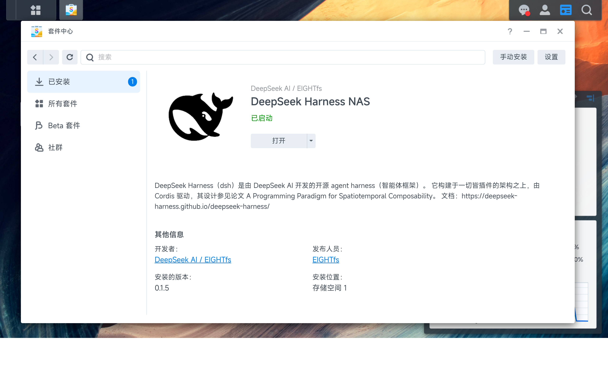
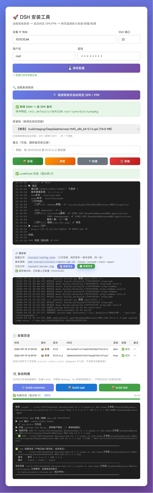

# DeepSeekHarness-NAS

> DeepSeek Harness 的群晖 DSM (.spk) / 飞牛 fnOS (.fpk) 平台适配包 — NAS 原生运行 DeepSeek Harness，无需 Docker

<p align="center">
  
</p>

[](https://opensource.org/licenses/MIT)
[](https://www.synology.com)
[](https://www.flywrc.com)

## 📦 简介

DeepSeek Harness (DSH) 是 DeepSeek AI 官方开源的 Agent 框架，提供 Web UI 管理界面，支持多模型配置、自定义 OpenAI 兼容端点。本仓库提供群晖 DSM (.spk) 与飞牛 fnOS (.fpk) 两个 NAS 平台的适配版本，品牌为 **DeepSeekHarness-NAS**（侧栏 + 浏览器标题）。

> 基线版本**不固定**：构建时自动拉取 dsh 官方最新 tag（`scripts/fetch-dsh-latest.sh --print-tag`），
> 产物版本号随官方滚动，故此处不记录具体基线号。实际版本以构建产物文件名与 Release tag 为准。

### 功能特性

- 🤖 **多模型支持** — DeepSeek 官方模型 + 自定义 OpenAI 兼容端点
- 🔌 **反向代理** — 内置透明反向代理（群晖 30800 → 内部 30801，飞牛 3080 → 内部 3081）
- 🛡️ **局域网限制** — 只放行私网 IP 段（127/10/172.16-31/192.168/169.254/0.x/fe80:/fc/fd），公网 IP 访问一律 403 中文提示页
- 🔐 **门户免密登录** — 群晖 Web（DSM 桌面/应用中心）打开套件入口时才携带 token（类似 Iventoy 的「打开」）：带过 token 后，浏览器局域网直接访问即免密；反之从未在网页端带过 token 的直接访问，因没有访问凭证而无法进入
- ⚙️ **Web UI** — 可视化模型管理和配置
- 🛡️ **安全模式** — DSH 启动失败时可一键禁用所有用户插件
- 🚀 **自动隐藏 token** — token 仅短暂出现在 URL 中，dsh 认证后自动收敛为干净地址
- 📝 **代理日志** — 每次请求记录 REQ/RESP 到 `/tmp/dsh-proxy.log`，便于排查

---

## 🚀 编译打包脚本

打包拆成几个脚本：**公共预编译只做一次**（`build/build-common.sh`），SPK / FPK 各自独立打包（`build/SPK/pack-spk.sh`、`build/FPK/pack-fpk.sh`），FPK 另有 npm 链路脚本（`build/build-npm-app.sh`）。发版走 **GitHub Actions 自动构建**（tag 推送即出 spk+fpk 双产物），本地脚本用于开发调试与手工兜底。

### 本地构建（等效 CI）

```bash
# 公共预编译：拉官方最新源 → pnpm install + build + 裁剪 → target
./build/build-common.sh

# 打 SPK（消费 target → build/staging/<APP_NAME>_x86_64-<版本>.spk）
./build/SPK/pack-spk.sh

# 打 FPK 源码链路（消费 target → build/staging/<APP_NAME>_x86-<版本>.fpk）
./build/FPK/pack-fpk.sh

# 打 FPK npm 链路（可选：npm 装官方包，免源码编译，体积更小）
./build/build-npm-app.sh        # 先装官方包生成 app_root
./build/FPK/pack-fpk.sh --npm          # 再打 FPK（--npm 消费 app_root）
```

### 全部脚本一览

| 脚本 | 作用 | 参数 / 示例 |
|------|------|-------------|
| `build/build-common.sh` | **公共预编译**：install 前白名单裁剪 devDeps + pnpm install + **build 前裁剪** + pnpm build + 纯白名单裁剪 → `target` 整树 + `build-meta.env`（输出 `build/master-build/build-<版本>/`）。**自探测**：①NODE_SRC（`tools/node-dist/node-v*`→PATH 带 headers 的 node→`/usr/bin/node`，并注入 PATH）②源码目录（多候选按 semver 取**最新**）③无 C 编译器时用「cc 替身 + 官方 native 预编译产物」完成 `build:native-system`（官方产物确定性，多来源 md5 一致）④tsc 堆上限（可用内存 75%，`DSH_TSC_MEM` 覆盖；0.2.0 源码需 >2.3GB）⑤**build 前裁剪**（install 后立即裁 `.pnpm`，`PRUNE_BEFORE_BUILD=0` 关闭） | `[SRC] [SKIP_BUILD] [--dry-run]`；`./build/build-common.sh "" 1` = 复用已有 target 秒级重打包；`--dry-run` = 全阶段预演（列计划不执行） |
| `build/gen-prune-whitelist.sh` | **白名单自动生成**：从 npm 链路 `package-lock.json` 的 packages 键解析包名全集（排除平台变体/claude/codex），写入白名单 `lockfileDeps` 字段（源码构建裁剪用）；只动 `lockfileDeps` 键，**不覆盖手动 `extra`** | `[锁文件]` / `--dry-run`；`./build/gen-prune-whitelist.sh` = 自动找最新锁文件更新白名单 |
| `build/prune-target.sh` | **纯白名单裁剪（独立可跑，三模式）**：①`--before-install <SRC>` install 前剥离非白名单 devDeps（省 install 峰值）；②`--node-modules <SRC>` **install 后、build 前**裁 `node_modules/.pnpm`（白名单 = 运行时 + **构建工具依赖闭包**，沿 `.pnpm` 软链自动递归，解决 esbuild/rollup 等传递依赖漏包）→ build 在精简树上跑；③默认模式裁已构建 target（白名单 = 运行时；force_exclude codex/claude/linuxmusl）。三模式均保留 `.pnpm/node_modules` 提升目录并清理其悬空软链 | `--before-install <SRC>` / `--node-modules <SRC>` / `<TARGET> [WHITELIST]` |
| `build/build-npm-app.sh` | **FPK npm 链路（可选）**：npm 装官方包（`--omit=dev`）→ `build/master-build/npm-app-<版本>/app_root`（免源码编译） | `[VERSION]`；`./build/build-npm-app.sh <版本>`（幂等，重跑秒级） |
| `build/SPK/pack-spk.sh` | 消费 target → 群晖 `.spk`（端口 30800/30801/30802） | 无参数；`./build/SPK/pack-spk.sh` → `build/staging/<APP_NAME>_x86_64-<版本>.spk` |
| `build/FPK/pack-fpk.sh` | 消费 target → 飞牛 `.fpk`（端口 3080/3081/3082）；`--npm` 消费 npm 链路 app_root（双链路并存） | `[--npm]`；`./build/FPK/pack-fpk.sh --npm` → `build/staging/<APP_NAME>_x86-<版本>.fpk` |
| `build/build-test-fpk.sh` | 构建**测试版** FPK（调试用，含版本标记） | 无参数 |
| `scripts/fetch-dsh-latest.sh` | 一键拉取 **DSH 官方最新版源码**到 `src/deepseek-ai/<tag>`（自动识别 tag）；**token 显式传参**（脚本不自找凭据文件）：`--token <ghp>` 或环境变量 `DS_FETCH_TOKEN`，不传则匿名（限流 60 次/h） | `./scripts/fetch-dsh-latest.sh [--token <ghp>]` |
| `scripts/fetch-release-mt.sh` | **多线程下载本仓 Release 资产**（spk/fpk）：走 api.github.com Git Data API 通道（不依赖 github.com 直连），aria2c 分段并发，失败回退 curl 单流；大小校验 + 已存在跳过；凭据取插件托管的 githubToken（不落命令行、不打印） | `[--tag <tag>] [--only spk\|fpk] [--threads N]`；`./scripts/fetch-release-mt.sh --only spk` → `release/<tag>/` |
| `scripts/promote-release.sh` | **发布提升**：验证通过的 `build/staging/` 产物 → `release/` | `D_REL=<dir>` 覆盖输出目录 |
| `web-install/install-remote-spk.sh` | **远程安装工具（群晖 DSM 专用）**：网页/SSH 远端装 spk（install/uninstall/check 三合一，root 补建软链） | 读 `install-config.json`（host/user/password/spk 路径） |
| `web-install/install-remote-fpk.sh` | **远程安装工具（飞牛 fnOS 专用）**：独立副本只做 fpk——install/uninstall/check + 安装后 root 补建 dsh/pnpm 软链（fnOS 生命周期钩子以应用用户执行，写不了系统 PATH，实测 uid=964） | 读 `install-config.json`（host/user/password/fpk 路径） |
| `web-install/install-server.py` | **网页安装服务端**：配置保存 + 系统探测 + 远程执行 + **安装历史**（版本+MD5+时间+结果+备注） | 端口 8765，配 `install.html` 前端；历史落盘 `install-tasks.jsonl`（gitignore 不入库） |
| `web-install/install-server-ctl.sh` | 8765 安装工具服务端启停脚本 | `start/stop/restart/status` |
| `web-install/clean-dsm-residue.sh` | DSM 卸载残留清理（包数据库/目录/systemd 缓存） | 远程执行 |
| `scripts/set-dsh-cpu-quota.sh` | 设置 DSH CPU 配额（cgroup 限制） | `./scripts/set-dsh-cpu-quota.sh` |
| `scripts/verify-dsh-cpu-quota.sh` | 验证 DSH CPU 配额是否生效 | 无参数 |
| `scripts/fix-dsh-settings-namespace.sh` | 修复 DSH alpha 版插件加载失败（`settingsNamespace` 缺失） | 幂等，含备份 |
| `scripts/fix-login-shell.sh` | **登录 shell 悬空探测与修复**：NAS/容器宿主常把服务账号登录 shell 记成 `/sbin/nologin` 但系统里没装该文件；DSH 的 `subprocess-local` 用 `process.env.SHELL \|\| os.userInfo().shell` 解析侧边栏终端默认 shell，拿到悬空路径后抛 `command "/sbin/nologin" is not an executable file`，侧边栏终端整体不可用。探测用 `id -u` + 解析 `/etc/passwd`（不依赖 getent），且只认**已导出**的 `SHELL`——bash 在 `SHELL` 未设时会自填一个非导出的 `$SHELL`，node 子进程看不到，按 bash 变量判会误报解析来源。修补幂等：先备份 `.bak-<时间戳>`，改写后过 `bash -n` 才写；目标先 `readlink -f` 解析软链再按 inode 去重，并**就地 cat 写入**而非 mv（mv 会换 inode，破坏硬链伙伴、把软链换成普通文件） | 无参数=只读探测报告；`--check` 精简输出供 CI；`--patch [文件...]` 插入兜底（默认自动探测 DSH start.sh）；`--passwd` 改 `/etc/passwd`（需 root + 输入确认串）；`--shell PATH`、`--dry-run`。退出码 0/3/1 |
| `scripts/generate-diff-report.sh` | 差分报告：对比正式版 / 测试版 FPK 差异 | 无参数 |
| `scripts/first-build-logic.sh` | 「首启构建」逻辑留档（从 start.sh 抽离，实际打包不再使用） | 仅文档 |
| `scripts/dsh` | **dsh CLI 包装器**：SSH 敲 `dsh` 直接用 DSH CLI（readlink 软链解析，多入口自适应） | 打进包 `bin/dsh` |
| `scripts/pnpm` | **pnpm 命令包装器**：随包 node 跑 pnpm.mjs（软链解析，路径与包名无关）。安装后提供 `pnpm` 命令，并供 `start.sh fix-deps` 依赖兜底解析缺包闭包 | 打进包 `bin/pnpm` |
| `scripts/migrate-session.sh` | **会话跨版本迁移**：把低版本 generation（如 0.1.2 的 v0）投放为目标 home 中可被自动迁移的会话，由 DSH 打开时沿 v0→v1→v2→v3 迁移边还原。内置两项格式契约校验：`sessions/` 根下裸目录会引发激活失败（`unsupported flat-file layout`，表现为工作区列表为空 + `directoryPickerController unavailable`）；`session.jsonl.zstd` 首帧必须恰好一行 header，`zstd` 整体重压缩会把帧合并成一帧并触发 `corrupt Zstandard session log`。改 header 只重建首帧、其余字节原样保留 | `--list` / `--check <文件>` / `--fix-layout` / `--cwd <新cwd> --in <源文件> --id <会话id>` / `--rollback [备份名]`，均可加 `--home <DSH_HOME>` |
| `scripts/migrate-session/` | `migrate-session.sh` 的实现模块（ESM）：`cli.mjs` 命令行入口，`index.mjs` 工具编排，`lib/{zstd,layout,import,inspect,target}.js` 分别负责 zstd 多帧读写、`sessions/` 布局校验、会话投放、日志探查与目标 home 探测；`cordis.patch.yml` 为 DSH 插件 bundle 声明 | 由 `migrate-session.sh` 自动调用，无独立入口 |
| `scripts/migrate-session/lib/follow.py` | **触发迁移**：`session/follow` 是流式 Remote 方法，必须走 WebSocket（HTTP 调会报 `stream Remote methods must be opened through the stream carrier`）。脚本先用启动日志里的 token 换 cookie，再带进 `ws://127.0.0.1:<port>/api/remote.mux` 握手；实测 HTTP 的 `session/page` 冷读**不触发**迁移，只有 follow 一走 `session.lock` 与 `session.v3.jsonl.zstd` 才落盘 | `python3 follow.py <会话id\|all> <DSH_HOME> [--port 30801] [--wait 90]` |
| `scripts/migrate-session/lib/wsclient.py` | `follow.py` 的最小 WebSocket 客户端（纯标准库）：握手、掩码帧发送、帧接收（含分片与 ping/pong）。目标机（群晖）无 `ws` / `websockets` 库，故手写 | 由 `follow.py` 导入，无独立入口 |
| `build/build-lib.sh` | **打包公共函数库**（SPK/FPK 共用）：`gen_start_sh()` 等构建级函数收口；库头写明「哪些能共用、哪些是生成给安装包的独立脚本不能 source」 | 由 `pack-spk.sh` / `pack-fpk.sh` source |
| `build/prune_common.py` | **裁剪公共模块**：`pkg_name()` / `pkg_deps()` / `index_pnpm()` / `expand_closure()`——按 pnpm 软链递归算运行时依赖闭包，供 `prune-target.sh` 各模式复用 | `PRUNE_COMMON_DIR` 指向其目录后 `from prune_common import ...` |
| `build/fix-runtime-deps.sh` | **运行时依赖补齐（打包期）**：探测内置插件入口 import，抓 `Cannot find package 'x'` 并从构建源补齐闭包 | `fix-runtime-deps.sh <TARGET> <BUILD_SRC> <NODE> [--max-rounds N]` |
| `scripts/learn-prune-whitelist.sh` | **白名单自动学习**：把「构建期真正 import 到、但不在白名单」的包学进 `_autoLearned`（不覆盖 `extra` 手工项） | 无参数；结果写入 `build/build-prune-whitelist.json` |
| `scripts/fix-pnpm-store.sh` | **pnpm storeDir 记录修复**：把 `.modules.yaml` 记录的 store 写进同级 `pnpm-workspace.yaml`（pnpm 11 不读 `.npmrc` 的 store-dir），无需重装 | 目标树路径（默认当前实例） |
| `scripts/fetch-official-docs.py` | 抓官方文档快照到本地（离线查阅/比对用） | `python3 scripts/fetch-official-docs.py` |
| `scripts/fix-dsh-bundle-patch-insert.py` | 修复官方 bundle 的 patch 声明插入问题（升级后内置插件加载异常时用） | `python3 scripts/fix-dsh-bundle-patch-insert.py <目标树>` |
| `scripts/check-readme-coverage.py` | **README 覆盖度守卫**：代码里的开关名/脚本名必须在 README 出现，否则退出码 1（CI 拦截「机制只活在注释里」） | `--list` 只列不失败 |
| `scripts/lib/common.sh` | **唯一公共函数库**（全仓库唯一实现，禁止各脚本再自定义）：日志文案 `info/ok/warn/miss/err/die/log_msg/section`、`safe_rm_rf`/`has_mount_under`（事故防线）、`rssh`/`rssh_remote_tmp`、`resolve_node`、`fetch_url`（断点续传 `-C -`）/`extract_tar`、`md5_of`/`b64_*`、`json_get`/`json_set`、`load_build_meta`、`resolve_pkg_version`、`check_pkg_size`、`running_dsh`、`pkg_*`、`gen_start_sh` | `. \"$ROOT/scripts/lib/common.sh\"` |
| `scripts/check-common-functions.py` | **公共函数唯一性守卫**：从公共库派生函数清单，断言其它 `.sh` 不得再定义（**剔除 heredoc 生成区段**，否则误伤打包器生成的运行时同名函数）；带显式豁免表 | `python3 scripts/check-common-functions.py` |
| `scripts/check-destructive-ops.py` | **破坏性操作守卫**：敏感路径（`@app*`/`/volume*`）的 `rm -rf` 必须带 `--one-file-system`；`web-install/` 不得自定义清理/挂载检测实现（分叉指纹）；`web-install/` 不得有未跟踪文件 | `python3 scripts/check-destructive-ops.py` |
| `scripts/check-workflow-yaml.py` | **YAML 结构守卫**：拦 `.github/**` 里会导致 action 加载失败的写法（未加引号的值含 `: `、缩进用 Tab、action 必需键缺失），并断言 `needs`/`needs.X.result` 引用的 job **必须存在**（实测：job 重构后引用悬空 → 状态误判 fail → Release 正文被写成"❌ 缺失"） | `python3 scripts/check-workflow-yaml.py` |
| `scripts/check-build-naming.py` | **命名与语法守卫**：job/action/脚本命名规范；**全部 `.sh` 跑 `bash -n`、全部 `.py` 跑 `ast.parse`**；`.sh/.py` 必须带可执行位（实测：`release-note.sh` 是 644 → CI 里 `./` 调用 exit 126）；排除 vendored `tools/` | `python3 scripts/check-build-naming.py` |
| `scripts/clean-dsm-residue.sh` | **清理唯一实现**（web 端与套件端共用；内含挂载点硬保护，绝不跨挂载点删） | `scripts/clean-dsm-residue.sh <套件名> [主机] [SSH用户]` |
| `scripts/gh-commit.py` | **备用提交通道**（GitHub Git Data API：blobs→tree→commit→更新 ref；原子多文件；author 固定 `EIGHTfs`；快进失败自动重取 HEAD 重试）。**不需要工作区写权限、不需要 git 二进制**，但**常规提交请优先用 git**（更快、有钩子与 diff 视图）——本机 `/bin/git` 已可用，故其定位是"git 不可用/无写权限时的备用通道"。token 取用顺序：`GH_TOKEN`/`GITHUB_TOKEN` → 候选 `config.json`（工作区 `config.json` 优先，可用 `DSH_GIT_PUSH_CONFIG` 指定其他路径）→ 全部失败则打印已尝试路径并以退出码 2 结束 | `python3 scripts/gh-commit.py <仓库根> "<提交信息>" <文件...>` |
| `test/safe-rm-rf.test.sh` | **事故回归测试**：断言含挂载点的目录绝不被删（用 `/proc` 验证检出能力，无需 root） | `bash test/safe-rm-rf.test.sh` |
| `scripts/prepare-build-env.sh` | 构建环境自动准备（幂等、只新增不删除、绝不 mount）：检测 noexec 挂载 / 补随包 node / 检查项目 pnpm / 补官方预编译 native 产物 / 拉官方源码快照 |

### 手工构建示例（开发调试用）

```bash
# ① 公共预编译（只跑一次，产出 target；全量约 15-20 分钟）
./build/build-common.sh                        # 全量：扫描源码 → install + build + 裁剪
./build/build-common.sh "" 1                   # 复用已有 target（跳过编译，秒级）

# ② 打包（消费 ① 的 target；无参数，配置读 build-config.yaml）
./build/SPK/pack-spk.sh                       # → build/staging/<APP_NAME>_x86_64-<SPK版本>.spk
./build/FPK/pack-fpk.sh                       # → build/staging/<APP_NAME>_x86-<FPK版本>.fpk

# ②' FPK npm 链路（可选）：npm 装官方包，无需源码编译
./build/build-npm-app.sh <版本>          # 下载 node + npm install 官方包（幂等）
./build/FPK/pack-fpk.sh --npm                 # 消费 npm app_root → 同路径 fpk
```

**参数与配置来源**（已精简，去掉「套件类型 / 套件说明 / 品牌名」三个参数）：

> 🎯 **FPK 双链路现状（2026-09-15 更新）**：**默认源码构建（与 SPK 同源），npm 链路保留可选**。
> - **源码构建**（默认，build-common.sh target → pack-fpk.sh）：品牌 **DeepSeekHarness-NAS**，与 SPK 同一套源码/裁剪/白名单；软链问题已修复（`tar --hard-dereference` 复制替代 `cp -a`），本地实测 **114MB 实机可装、三端口在听**；**CI 默认且当前唯一自动执行的链路**。
> - **npm 链路**（`--npm`，官方 npm 包，`build-npm-app.sh`）：品牌 DeepSeek Harness，体积更小（94M）；**自 2026-10-04 起 CI 留档不执行**，仅本地手动跑（`./build/build-npm-app.sh && ./build/FPK/pack-fpk.sh --npm`）。
> - 体积基线：源码 114MB ≈ 120MiB 以内（白名单裁剪后达标）；npm 94M ≈ 100MiB。

- `SRC` 源码目录：缺省通配扫描 `src/deepseek-ai/*`（不硬编码版本目录名），其次 `build/master-build/master-build`
- `SKIP_BUILD`：`1` = 复用已有 target（快速重打包），缺省 `0` = 全量构建
- **套件说明 / 品牌名 / 端口**：不走命令行参数，统一读 `build/build-config.yaml`（`defaults` + `spk:` / `fpk:` 段），单一真源
- **版本号**：从源码 `package.json` 自动读取（SPK 取前三位，即 `<版本>-<预发布>` 只保留 `<版本>`；FPK 取完整串含预发布后缀）
- **元数据传递**：`build-common.sh` 写 `build/master-build/build-<版本>/build-meta.env`，两个打包脚本 `source` 它（避免各脚本重复推导版本/名字/描述）
- **环境变量覆盖**：`APP_NAME` / `D_SRC` / `D_BUILD` / `D_STAGING` / `D_ASSETS` / `D_SCRIPTS` 可临时覆盖（换名实验、目录迁移）

> **打包模式**：唯一模式 = 预构建产物包（装完即用，无首启构建）。
> 原「精简包首启构建」逻辑（`ensure_built` + 构建进度占位页）已抽离留档，见 `scripts/first-build-logic.sh`（实际打包不再使用）。

产物统一输出到 `build/staging/`（验证后 `promote-release.sh` 提升到 `release/`，可用 `D_REL=<dir>` 覆盖）。**历史发布版已清理，今后发版统一走 GitHub Actions 自动构建**（见下文「自动构建」）。

脚本自动完成（★ 标注执行脚本）：

- **品牌修改** ★`build-common.sh`：locale 内 `DSH Local Build` → `DeepSeekHarness-NAS`（en/zh）+ 构建后 html title 兜底
- **小字完整版本号** ★`build-common.sh`：构建注入 `DSH_CLIENT_VERSION` / `DSH_CLIENT_COMMIT_HASH` / `DSH_CLIENT_TITLE`，界面显示 `<官方版本>-<commit>[-dirty]`（与官方版本同步）
- **SPK 版本号** ★`pack-spk.sh` = 官方版本前三位（`<版本>-<预发布>` → `<版本>`），无 build 后缀，同版本安装直接覆盖
- **门户资源** ★`pack-spk.sh` / `pack-fpk.sh`：`ui/` + `spk-templates/ui-config.json` 打进 package.tgz，DSM 安装时自动建 `webman/3rdparty/deepseek-harness-nas` 链接，桌面出现套件图标

### 本地构建 vs 在线构建（差异对照）

两条链路**共用同一套构建脚本**（`build/build-common.sh` → 裁剪 → 打包器），差别只在**运行环境与编排**。
下表为实测差异（2026-10-04）：

| 维度 | 本地构建 | 在线构建（GitHub Actions） |
|---|---|---|
| 入口 | `web-install/install-server.py`（Web API `127.0.0.1:8765`）/ 直接跑 `build/build-common.sh` | `.github/workflows/build.yml` |
| 运行环境 | 群晖 NAS。**必须从可执行挂载启动**：`@appdata/.../工作区`（`VirtualDSM/...` 是 **noexec**，构建会失败） | `ubuntu-latest` runner（无 noexec 限制） |
| 前置准备 | `scripts/prepare-build-env.sh`（随包 node / 官方预编译 native / 官方源码快照，幂等、绝不 mount） | `./.github/actions/setup-node-env` + `./.github/actions/fetch-latest` |
| 源码获取 | 本地快照 `src/deepseek-ai/<tag>`，可跨构建**复用** | `scripts/fetch-dsh-latest.sh`（优先本地 git 镜像**增量**拉取，退化到 clone/zipball） |
| 缓存复用 | pnpm store + **单一复用构建目录** `build/`（`SKIP_BUILD=1` 复用 target、`BUILD_STAGE=build\|prune` 分阶段续跑、`FRESH_BUILD=1` 时间戳归档） | **三层缓存**：源码 git 镜像 ✓ + pnpm store ✓ + **已构建 target**（tar 单文件，key=官方 tag+构建逻辑指纹）✓ → 实测命中后日志打印 `✓ 复用 target: …（未重新构建）`，**跳过约 20 分钟编译** |
| 产物 | `build/staging/*.spk\|*.fpk` → `scripts/promote-release.sh` → `release/` | Actions artifacts + GitHub Release |
| 链路数 | 按需（通常单链路调试；npm 链路可手动跑） | **2 产物**：SPK + FPK（均源码链路）；npm 链路**留档不执行** |
| 发布 | 手动 `promote-release.sh` | `pack-and-release` job 自动发/更新 **1 个** Release（正文含**官方同 tag 更新日志**，由 `build/release-note.sh` 统一渲染）；构建失败则不发布 |
| 安装 | `web-install/install-remote-spk.sh` / `install-remote-fpk.sh` 远程装到目标机 | 不含安装 |
| 并发 | Web API 单入口（**禁并发**，同刻只允许一个构建） | `concurrency` 组 **cancel-in-progress: true** —— 新构建开始前停掉上一个（同刻只有一个） |
| 特有坑 | noexec 挂载、中文路径编码易被破坏、`rm -rf` 跨挂载点（2026-10-03 事故） | `upload-artifact` 逐文件压缩会 OOM（用 tar 单文件规避）；缓存 tar 漏 `.build-done` 会让复用静默失效；`needs.*` 重构后悬空会让 Release 正文误写"❌ 缺失" |

> 两条链路**都必须**遵守同一套守卫（`scripts/check-*.py`）与公共库（`scripts/lib/common.sh`），
> 任何"只在本地能过"的环境变量覆盖都应视为**根因未修**，修进脚本而不是绕过。

### GitHub Actions 自动构建（发版走这里）

```yaml
# .github/workflows/build.yml —— 触发: 定时(每日04:00 UTC) / workflow_dispatch(手动) / tag推送
# jobs（2026-10-04 重构后共 2 个）:
#   build-target      唯一构建：setup → fetch → ci-clean → ./build/build-common.sh → 上传 target
#   pack-and-release  复用 target → 打 SPK + FPK → 解析官方 tag → 发 Release（含官方更新日志）
# 产物命名: <APP_NAME>_<平台>-<版本>.<spk|fpk>
```

- 触发：①每日 04:00 UTC（北京 12:00）定时拉官方最新源构建；②Actions 页手动 `workflow_dispatch`；③推送 tag
- **并发控制**：`concurrency: group=<workflow>-<ref>, cancel-in-progress: true` —— **新构建开始前会停掉上一个**（用户口径：同一时刻只有一个构建，也比两个并行更省 runner 分钟）
- **构建只做一次（本次重构核心）**：只有 `build-target` 跑 `./build/build-common.sh`；打包在 `pack-and-release` 内完成，**复用 target 而非重编**（旧结构里 `build-spk` 与 `build-fpk-source` 各跑一遍完整构建，每次白烧约 20 分钟）
- **target 复用缓存**：`build-target` 内按 **官方 tag + 构建逻辑指纹**（`build-config.yaml`/`build-common.sh`/`prune-target.sh`/`prune_common.py`/白名单 json/`scripts/lib/common.sh`/两个 action 文件）缓存 `build/master-build/build`，命中即解包 → `build-common.sh` 走 `SKIP_BUILD` **跳过编译**（日志会打印 `✓ 复用 target: …（未重新构建）`）
  - ⚠ 缓存 tar **必须包含 `.build-done`**：`build-common.sh` 的复用判据是 `[ -f "$WORK/.build-done" ] && [ -d "$TARGET" ] && [ -f "$TARGET/package.json" ]`，漏了它解包后判据不成立，会**静默完整重编**
- **为何用 tar 单文件**：`upload-artifact@v4` 逐文件处理，745M+ 海量文件会爆 4GB 堆（实测 `FATAL ERROR: Ineffective mark-compacts near heap limit`）；先 `tar -czf` 再上传单文件即根治（`compression-level: 0`，因为已是 `.tar.gz`）
- **产物开关**：仓库变量 `vars.BUILD_SPK` / `vars.BUILD_FPK`（`'false'` 跳过对应产物；缺省都构建）
- **npm 链路自 2026-10-04 起留档、CI 不执行**：`build/build-npm-app.sh` 头部写明本地手动命令（`./build/build-npm-app.sh && ./build/FPK/pack-fpk.sh --npm`）与恢复自动执行的方法
- **自动发布（与官方同 tag）**：tag 取官方最新 dsh tag（`scripts/fetch-dsh-latest.sh --print-tag`，形如 `dsh-v<版本>`）；同名 Release 已存在则**覆盖资产与正文**（滚动刷新）；统一发正式 Release，不标 prerelease
- **不再"部分失败容忍"**（2026-10-04 用户口径）：构建失败即**不打包、不发布**（此前 `release` job 的 `if: always()` 已移除）——避免发出缺项 Release；Release 正文的状态徽标由「检查产物」步骤给出（源码链路两个产物在本 job 依赖成功时即 `success`）
- **artifact**：`build-target`（**tar 单文件**，供 pack 复用）+ `build-target-debug-log` / `pack-and-release-debug-log`（完整 `pnpm-build.log`，因 GitHub 偶尔不归档该 job 日志）
- **Release 自带 SHA256**：正文含每个产物的 `sha256sum`，下载后 `sha256sum <文件>` 对照
- **守卫套件（构建前先跑，任一失败即红）**：`scripts/check-workflow-yaml.py`（YAML 结构 + `needs` 悬空引用）、`check-readme-coverage.py`、`check-common-functions.py`、`check-destructive-ops.py`、`check-build-naming.py`（含 `.sh/.py` 可执行位）、`test/safe-rm-rf.test.sh`（事故回归）
- **install 前白名单裁剪**（2026-09-14，SPK CI 磁盘爆盘修复）：官方 monorepo 依赖树约 1.78 万包，install 阶段会拉满 runner 磁盘；`prune-target.sh --before-install` 在 `pnpm install` **前**用纯白名单剥离根 `package.json` 中**非白名单 devDependencies**
  - ⚠ 2026-10-04 教训：被剥掉的**根 devDep** 若正是某个构建期解析入口的**唯一来源**，其传递依赖会随之不再安装 → 构建期 `TS2307`（实测 `vitest` 被剥 → 传递依赖 `vite` 缺失 → `vite.ts(5,55): Cannot find module 'vite'`）。故白名单必须完整：学习器已支持解析 **pnpm 安装摘要**（`+ <包> <版本>`）自动补齐这类根 devDep
- **本地等效**：按「本地构建」段落逐脚本跑（同一套 fetch → build → 打包 流程）

### 打包模式：预构建产物包（唯一模式）

| 类型 | 产物文件 | 说明 |
|------|----------|------|
| SPK | `build/staging/<APP_NAME>_x86_64-<SPK版本>.spk` | 预构建产物包：本地构建产物 + 裁剪后 node_modules，装完即用 |
| FPK | `build/staging/<APP_NAME>_x86-<FPK版本>.fpk` | 同上（手动 tar+gzip；app.tgz 与外层均无 `./` 前缀） |

> **裁剪（有依据，非盲删）**：①非 linux-x64 平台变体（darwin/win32/arm/musl/ia32…）；②**devDependencies 及其传递依赖**（清单从根 `package.json` 动态读取，不硬编码——已实测删后 `dsh --version` 与 web HTTP 200 正常）；③claude-agent-sdk/codex（体积大头，明确不需要）；④`packages|apps` 的 src（构建产物在 lib/dist）+ docs/benchmarks/native。保留：`bin/node` + `bin/dsh` + `bin/pnpm` + 随包 pnpm + 各包 lib/dist 产物 + 运行时 node_modules。
>
> **白名单自动生成（2026-09-13）**：`build/gen-prune-whitelist.sh` 从 npm 链路 `package-lock.json` 的 packages 键解析包名全集（实测磁盘实际包 522 个全部落在锁文件 582 条引用内，0 误删）→ 写入白名单 `lockfileDeps` 字段（排除平台变体/claude/codex 后 489 个）；与 `extra` + `workspaceRuntimeDeps`（动态收集 target/packages 的 dependencies）取并集，黑名单候选命中即保护。裁剪逻辑独立为 `build/prune-target.sh`，可单独对已有 target 重跑（白名单更新后免重编译）。
>
> **官方依赖表（裁剪依据，来源 dsh 官方 requirements）**：

<a id="prune-whitelist"></a>
### 裁剪白名单：三层来源 + 自动学习

裁剪（`build/prune-target.sh`）是**纯白名单**语义：不在白名单里的 `.pnpm` 目录一律删除。
白名单由**三层**合成，任一层漏掉都会表现为"包明明装了却找不到"：

| 层 | 来源 | 谁维护 |
|---|---|---|
| `lockfileDeps` | `build/gen-prune-whitelist.sh` 从 npm 链路 `package-lock.json` 的 packages 键解析包名全集 | 脚本自动生成 |
| `workspaceRuntimeDeps` | 动态扫描 `target/packages/**/package.json` 的 `dependencies`（运行时必需） | 打包期自动收集 |

> **口径提醒（2026-10-04 审核修正）**：`extra`（构建工具/类型检查包）**只在模式 A**（install 前）用于保护 tsc，**不进最终 target** —— 模式 B 的白名单是 `lockfileDeps` + `workspaceRuntimeDeps`（代码与文件头表均已按此口径修正）。
| `extra` + `_autoLearned` | 手工补充的强制保留项；`_autoLearned` 由 `scripts/learn-prune-whitelist.sh` **自动学习** | 手工 + 自动学习 |

**自动学习（`scripts/learn-prune-whitelist.sh`）**：把「构建期真正 import 到、但不在白名单」的包
学进 `_autoLearned`，且**不覆盖** `extra` 里的人工项（`gen-prune-whitelist.sh` 只动 `lockfileDeps`）。
学习面的边界：当前主要覆盖根 `devDependencies` 与构建必需工具；**workspace 各包的构建期依赖
（如 `vite`、`@types/semver`）仍需纳入学习面**，否则本地全量类型检查会缺包。

**相关开关**（外部可见，务必按需设置）：

| 开关 | 默认 | 语义 |
|---|---|---|
| `PRUNE_BEFORE_INSTALL` | `1` | install **前**剥离非白名单 devDeps（省 install 峰值磁盘）；本地构建物模式会跳过 |
| `PRUNE_BEFORE_BUILD` | `1` | install 后、build **前**裁 `.pnpm`（省 build 内存/磁盘）。置 `0` 关闭 |
| `BUILD_STAGE` | `all` | `install` / `build` / `prune` / `all`：分阶段跑（`build` 阶段复用已装好的构建副本，跳过复制） |
| `SKIP_BUILD` | `1` | 复用已有完整 target；`0` 强制全量重建 |
| `NPM_MODE` | `0` | FPK 走 npm 链路（`pack-fpk.sh --npm`）时置 1；影响产物命名后缀 `-npm` |
| `PRUNE_COMMON_DIR` | 脚本同级 | `prune_common.py` 所在目录（供内联 python 导入） |
| `DRY_RUN` | `0` | 预演：只打印计划不执行（多数脚本支持 `--dry-run` 或该环境变量） |
| `DSH_GIT_BIN` | 自探测 | git 可执行文件路径覆盖（群晖 git 在 `/var/packages/git/target/bin`，PATH 里常没有） |
| `DSH_NODE_DIST` | 自探测 | node 发行版目录覆盖（`resolve_node()` 按 `/usr/bin/node` → `$DSH_NODE_DIST/node-v*/bin/node` → 随包 `tools/node-dist/` 顺序解析；公共库 `scripts/lib/common.sh` 提供） |
| `DS_FETCH_GIT_URL` | 官方仓库 | `fetch-dsh-latest.sh` 的 git 远端覆盖（走镜像/内网时用） |
| `DSH_PROXY_PORT` | `30800` | 反代端口覆盖（等价 `--proxy-port`） |
| `DSH_SLIM_SKIP_NATIVE` | `0` | 置 1 跳过 native 构建（`first-build-logic.sh` 留档脚本用） |
| `DSH_TOKEN_FILE` | 自动探测 | GitHub token 文件路径覆盖（`fetch-release-mt.sh` 下载本仓 Release 资产时用） |
| `DSH_VERSION` |  | 官方源码版本覆盖（`prepare-build-env.sh` / `fetch-dsh-latest.sh` 用；决定拉取 `src/deepseek-ai/dsh-v<ver>`） |

**失败症状对照**（先查白名单，再怀疑"没装"）：

| 症状 | 真因 | 处置 |
|---|---|---|
| `error TS2307: Cannot find module 'x'` / `TS7016: Could not find a declaration file` | **白名单缺构建期依赖**：`.pnpm` 实体还在，被删的是顶层解析入口 | 把包学进白名单（`learn-prune-whitelist.sh` / `extra`）；**不要**用 `PRUNE_BEFORE_BUILD=0` 长期绕过 |
| `sh: pnpm: not found` | pnpm 垫片/PATH 问题（垫片在 `tools/pnpm/bin/pnpm`） | 检查垫片是否存在且 `PATH` 前置了 `PNPM_BIN_DIR` |
| `Cannot find package 'x' imported from …`（运行时，非构建期） | 随包发布时漏带运行时依赖 | 打包期用 `build/fix-runtime-deps.sh`；实机兜底用 `start.sh fix-deps` |

| 依赖类别 | 具体项 | 是否必需 |
|---|---|---|
| 核心运行时 | Node.js ^22.19.0 或 >=24.0.0 | ✅ 必需 |
| 原生模块 | node-pty, sharp, koffi, esbuild, ripgrep | ✅ 随 npm 安装（**不能裁**，裁剪后已验证完好） |
| 系统库 (Linux) | libc6 (GLIBC)，版本因架构而异 | ✅ 必需 |
| 构建工具 (源码) | pnpm 11.7.0, Git 2.26+, Python 3.10+, C++ 工具链 | 仅源码安装需要（预构建包**不需要**，devDeps 裁剪即依据此条） |
| 可选 | Python 3.10+ (SDK), Docker, 浏览器 | 按需 |

> **验收标准**：安装后能启动、30800 端口可达、门户免密跳转正常、`dsh`/`pnpm` 命令可用。

### 构建产物

| 产物 | 说明 |
|------|------|
| `DeepSeekHarness-x86_64-<版本>.spk` | 群晖 DSM 套件包（内嵌 node + dsh 官方源全量编译） |

---

## 🔌 三端口说明（一套应用、三个入口）

每个平台都用 **1 个反代端口 + 1 个 DSH 原生端口 + 1 个容器页面端口**。DSH 原生服务只监听 `127.0.0.1`，对外一律走反代端口（带门户认证 / 局域网白名单）。

| 端口 | 监听 | 作用 | 访问方式 |
|------|------|------|----------|
| **3080**（fpk）/ **30800**（spk） | `0.0.0.0` | **反代端口**：用户唯一入口。套件门户打开自动带 token 免密；局域网直连 403；认证后免密；公网 IP 一律 403 | 浏览器 `http://<NAS-IP>:3080` |
| **3081**（fpk）/ **30801**（spk） | `127.0.0.1` | **DSH 原生端口**：dsh web 服务本体，仅本机可访问（安全边界） | 本机 `curl 127.0.0.1:3081` |
| **3082**（fpk）/ **30802**（spk） | `0.0.0.0` | **容器页面端口**：dsh-repair 守护的容器管理页，同反代策略（局域网放行 / 公网 403） | 浏览器 `http://<NAS-IP>:3082` |

```
 浏览器/门户
     │ 3080 (0.0.0.0)
     ▼
 反代 (Node http.createServer)
     ├─ ⓪ 局域网硬闸 isLoopbackOrLan(ip) —— 公网 IP → 403 中文提示页
     ├─ ① 门户来源（无 cookie）→ 302 ?token= 免密认证 <!-- dsh-skip-sensitive: 文档在描述门户免密的设计机制（302 带 token），非真实凭据泄露 -->
     ├─ ② 已持 dsh-auth cookie → 透明放行（带过 token 即免密）
     └─ ③ 直连（Sec-Fetch-Site:none / 异主机 Referer）→ 403「请从套件图标打开」
        │
        ▼ 127.0.0.1:3081
     DSH web（dsh web 原生端口，仅本机）
```

- **端口不写死**：脚本/代码一律调 `read_ports <system>` 读 `build/build-config.yaml`（`defaults` / `spk:` / `fpk:` 三段），禁止出现端口字面量
- **双平台并存**：spk 用 30800 段、fpk 用 3080 段，互不冲突，可同机共存
- **命令行自定义**：`./start.sh --proxy-port N --dsh-port N --container-port N start`

---

## ⚙️ start.sh 功能详解

`build/start.sh.example` 是 SPK/FPK 运行脚本的**唯一母版**（调 `__PROXY_PORT__` / `__DSH_PORT__` / `__CONTAINER_PORT__` 等占位符，打包脚本按平台替换为最终 `bin/start.sh`，一个母版双平台复用）。功能清单：

### 1. 服务生命周期（start/stop/restart/status）

```bash
./start.sh start          # 启动：找 DSH → 起 dsh web → 起反代 → 起容器守护 → 校验三端口
./start.sh stop           # 停止：PID 精确终止（先 TERM 后 KILL），清端口
./start.sh restart        # 重启：stop + start（未启动时相当于 start）
./start.sh status         # 状态：DSH 进程存活 + 三端口监听检查，退出码 0/3（供外部判活）
./start.sh fix-deps       # 依赖兜底：按启动日志的缺包记录，用随包 pnpm 在线补齐（打包阶段应已带全，这里是最后一道防线）
```

- **cmd_status 返回退出码**（0=运行中 / 3=未运行），供 fnOS/DSM 判活；运行检测 `pgrep -f "<绝对路径>/bin/start.sh"` 精确匹配，避免宽松匹配误判
- **依赖兜底 `fix-deps`（2026-10-03）**：打包阶段负责把运行时依赖**离线带全**，本子命令只是**最后一道防线**——`start` 因缺包失败时自动触发一次（读日志 `Cannot find package 'X'` → 用随包 `bin/pnpm` 解析该包完整依赖闭包 → 平铺补进实例 `node_modules`，补完重试一次启动；`DSH_DEPS_RETRIED` 防重试递归），也可手动执行。缺包版本从 pnpm 悬空软链反解（`fontkit -> ../../fontkit@2.0.4/…`，scoped 包目录名把 `/` 写成 `+`），registry 取 `DSH_NPM_REGISTRY`（默认国内镜像）。**刻意不做全量扫描补齐**：现场悬空软链 200+ 条且绝大多数是构建期 devDependencies，全补等于把裁剪掉的 dev 依赖又装回来。任何一步失败只记日志、**不阻断启动**。
- **PID 文件禁放 /tmp**（fnOS `/tmp` 无 sticky 位，应用用户无权限）→ 移入 `$DSH_HOME_PARENT/DeepSeekHarness-NAS.pid`

### 2. 实例定位（多布局自适应）

`find_dsh_dir()` + `detect_entry()` 按顺序探测实例入口：

```
① node_modules/@deepseek-ai/dsh/lib/bin.js   ← npm 链路（build-npm-app.sh 产物）
② apps/cli/lib/bin.js                        ← 官方源码编译产物（build-common.sh 产物）
③ lib/bin.js                                 ← 兜底
```

- `find_node()` 依次找 `bin/node`（随包）→ `/usr/local/bin/node` → `/usr/bin/node` → PATH（不硬编码第三方套件路径）
- `resolve_pkg_version()` 版本优先级：dsh 包 version → npm 产物 localBuildVersion → 顶层 package.json（打包期也注入兜底值）

### 3. 品牌与版本名牌（网页左上角）

- `BRAND_NAME` = `DeepSeekHarness-NAS`（侧栏 + 浏览器标题 + 网页左上角）
- 小字版本号显示 `<官方版本>-<commit>[-dirty]`，与官方版本同步（`DSH_CLIENT_VERSION` / `DSH_CLIENT_COMMIT_HASH` / `DSH_CLIENT_TITLE` 注入）

### 4. 反代：门户免密 + 局域网硬闸 + 直连 403

请求处理顺序（`proxyServer` 回调）：

```
⓪ 局域网硬闸  isLoopbackOrLan(req.socket.remoteAddress)
     不是 127/10/172.16-31/192.168/169.254/0.x/fe80:/fc::/fd:: 私有段 → 403 中文提示页
① 已持 dsh-auth cookie → 透明放行（带过 token 即免密，直连也放行）
② 门户打开（cross-site + 同主机 Referer / iframe / 无 Referer）→ 302 ?token= 自动认证 <!-- dsh-skip-sensitive: 描述门户免密的设计机制（302 自动带 token），非真实凭据 -->
③ 地址栏直连（Sec-Fetch-Site: none / 异主机 Referer）→ 403「请从套件图标打开」
```

- **门户免密原理**：套件桌面图标打开（DSM https:5001 → http:30800 / fnOS 应用 iframe）请求特征 = `cross-site` + 同主机 Referer → 反代 302 无条件带 `?token=`；dsh 认证后 303 收敛干净 URL 并种 `dsh-auth` cookie；此后浏览器直连即免密 <!-- dsh-skip-sensitive: 说明免密原理，token 是运行时生成并经 302 传递，非硬编码凭据 -->
- **直连 403**：地址栏直接访问（`Sec-Fetch-Site: none`）因为从未经过门户带 token、无访问凭证 → 403 提示「请从套件图标打开」，页面内 XHR/WS 一律放行（只对文档级导航设卡）
- **局域网限制（2026-09-13 新增）**：只放行私网 IP 段，公网/外网 IP 访问 → 403 中文提示页（`LAN_ONLY_PAGE`）——「只能局域网访问」的最终防线，先于一切认证逻辑
- **SameSite=Strict → Lax 改写**：跨 scheme（DSM https→http）cookie 不被丢弃，防 ERR_TOO_MANY_REDIRECTS
- **代理日志**：每次请求 REQ/RESP 记到 `$DSH_HOME_PARENT/dsh-proxy.log`（含 cookie 前缀，可确认 token 跳转链路）

### 5. 容器页面（3082）

`containerServer` 与反代同策略：局域网放行 + 公网 IP 403 + 门户免密。DSH 内部容器/子服务管理页（dsh-repair 守护，端口 `DSH_REPAIR_CONTAINER_PORT`）。

### 6. 端口与 token

- 启动时自动生成 token：`http://<NAS-IP>:<反代端口>/?token=...`（token 仅短暂出现在 URL，认证后自动收敛） <!-- dsh-skip-sensitive: 说明启动时生成 token 的用法，非硬编码凭据 -->
- 运行检测通过才报启动成功（rc=0），三端口校验（DSH=3081 / 反代=3080 / 容器=3082）

### 7. DSH_HOME 与插件安装（start.sh 自动指定）

`dsh` 按 `$DSH_HOME/profiles/<name>` 定位 profile。若 `DSH_HOME` 未指定，dsh 会落到 `$HOME/.dsh`
（在 DSM 上以 root 登录 SSH 时即 `/root/.dsh`），与套件实际使用的 home 不是同一个位置，
结果是 `dsh plugin add` 装进了服务读不到的地方——表现为「插件装完不生效」。

start.sh 已自动处理，**安装后无需手工指定**：

- **服务侧**：启动时 `export DSH_HOME="<PKG_VAR>/<版本>/.dsh"`（强制覆盖，不接受外部残留值），
  dsh 子进程继承同一 home。
- **CLI 侧**：`dsh` 命令由 start.sh 装成 wrapper（`/usr/bin/dsh` → `/usr/local/bin/dsh` →
  `$HOME/.local/bin/dsh` 依次尝试），wrapper 内注入同一 `DSH_HOME`；
  若用户已自行 `export DSH_HOME`，wrapper **尊重用户设置**不覆盖。
- **手动启动侧（2026-09-22）**：SSH 直跑 `./start.sh`（无 TRIM_PKGVAR / SYNOPKG_PKGVAR /
  PKG_VAR 注入）时，自动探测群晖套件标准数据目录（`/var/packages/<APP>/var` →
  `/volume*/@appdata/<APP>`），解析到与服务侧**同一 DSH_HOME / 同一 PID 文件**——
  避免「手动启动 vs 套件启动两套实例」导致 AI/手动 restart 操作错误实例；
  fnOS（TRIM_PKGVAR 注入走独立分支）与纯目录部署（探测不到，回退 `.dsh-home`）不受影响。

插件管理：

```bash
dsh plugin --profile web add <包名>       # 安装（写入上述 home 的 web profile）
dsh plugin --profile web list             # 查看已装
synopkg restart DeepSeekHarness-NAS       # DSM：装完必须重启才加载（对 FPK 用对应重启方式）
```

> 注意：插件安装属**运行时数据**，落在 `PKG_VAR/<版本>/.dsh`，不随包升级覆盖（数据按版本隔离）。

### 8. 登录 shell 兜底（侧边栏终端可用）

fnOS / Synology 把包服务用户的登录 shell 记成 `/sbin/nologin`，但该文件在系统里并不存在
（`/sbin -> usr/sbin`，`/usr/sbin/nologin` 缺失）。DSH 的 `subprocess-local` 用
`process.env.SHELL || os.userInfo().shell` 解析侧边栏终端默认 shell；不设 `SHELL` 时读
`/etc/passwd` 得到悬空的 `/sbin/nologin`，终端创建直接失败：
`subprocess-local: command "/sbin/nologin" is not an executable file`。

start.sh 已自动处理，**无需手工设置**：

```bash
[ -x "${SHELL:-}" ] || export SHELL=/bin/bash
```

继承值本身可执行就保留（尊重用户已配置的 shell），不可执行或未设置才回退到真实存在的 bash。
只做运行时环境修正——不改 `/etc/passwd`，不给服务账号可交互登录 shell。

---

## 🚀 安装与访问

> 截图（DSH 网页主界面——安装后门户打开即进入）：

> 

### 群晖 DSM（.spk）

> 截图（DSM 门户打开套件 → 自动带 token 进入）：

> 

```bash
# 前置条件：DSM 7.2+，x86_64 架构（已内置 node，无需额外安装）
# Package Center → 手动安装 → 选择 .spk
```

- **安装向导（`WIZARD_UIFILES/`，群晖官方机制）**：套件中心安装/卸载时弹窗收集参数，值以 `wizard_*` 环境变量传给 `scripts/installer`：
  - **安装时填端口**：可选填「门户端口 / DSH 端口 / 容器端口」（留空 = 打包默认 `30800/30801/30802`）。`postinst` 把填写值写入 `<数据目录>/<版本>/ports`，`start-stop-status` **优先读它**（跨升级保留）→ 支持**同机多实例用不同端口并存**；
  - **卸载时选数据**：卸载向导提供「**仅卸载（保留文件）** / **彻底删除数据（不可恢复）**」单选（默认保留）。`installer` 依 `wizard_delete_data` 决定是否清理数据目录——选保留则重装即恢复，选删除才清理；
  - **版本覆盖 + 数据保留（2026-10-02 实测）**：套件用固定 package 名（`DeepSeekHarness-NAS`），DSM 对同名套件重装**一律按全新安装处理**（先 `rm -rf /var/packages/<pkg>` 再重建），版本号被新包覆盖——这是 DSM 预期行为。**数据不会丢**：数据在 `@appdata` 的**版本隔离目录**（`var/<版本>/`，如 `0.1.5-rc.2` / `0.2.0-rc.2` 并存），DSM 清理 `/var/packages/` 不碰 `@appdata`；跨版本重装后旧版本数据完整保留。如需**多版本同时安装/启动**（python2/python310 模式），须改版本化 package 名（当前未采用，保持覆盖安装 + 数据保留）；
  - 文件：`install_uifile`(+`_chs`) / `uninstall_uifile`(+`_chs`)，中英双语。
- Web 入口：DSM 桌面套件图标（网页端打开＝携带 token 的第一步），或访问 `http://<NAS-IP>:30800`
- **门户免密原理（权威设计·禁止改动，参考 SA6400 Iventoy 套件「打开」机制）**：
  1. **群晖 Web 打开才带 token** — DSM 网页（桌面套件图标 / 应用中心）打开套件入口时，浏览器请求才携带 token（同 aria2 / Iventoy 等套件的「打开」方式）；**直接地址栏访问 `http://<NAS-IP>:30800` 不携带 token**；
  2. **带过 token，局域网访问就不用带 token** — 首次经网页端带 token 打开后，浏览器已有访问凭证（会话 cookie），此后直接访问 `http://<NAS-IP>:30800` 即免密；
  3. **反之，Web 没打开过（没带过 token）的直接访问，因为没有带过 token 而无法访问** — 未从网页端建立过凭证的请求不会放行。
  - **实现落点**（`build/start.sh.example` 反代段 + 打包脚本 gen_start_sh / gen-portal）：入口收敛 `isDirectAccess()` 判定 + 门户打开时自动 `302 ?token=` 完成认证（认证后 303 收敛干净 URL）；`SameSite=Strict → Lax` 改写解决跨 scheme cookie 丢弃；401 兜底自动重认证。 <!-- dsh-skip-sensitive: 说明实现落点与 302 带 token 的机制，非凭据 -->
  - **禁止**：反代不得对「无访问凭证的任意请求」无条件附加 token（会破坏第 3 条，等于开放无鉴权访问）；不得删除 `isDirectAccess()` 入口收敛（否则直连也免密）。
  - **入口收敛判定**（`build/start.sh.example`，实测 2026-09-13 VirtualDSM）：只对文档级导航（`Sec-Fetch-Dest: document/iframe/frame`）设卡，页面内 XHR/WS 一律放行；`Sec-Fetch-Site: none` = 地址栏直连 → 403；无 `Sec-Fetch-*` 头（旧 WebView）退化为 Referer 同主机判定；`cross-site` 且异主机 Referer = 外站跳入 → 403；DSM 门户 https:5001 → http:30800（同主机跨 scheme）与 fnOS 门户 iframe 均放行 → 302 带 token；已持 `dsh-auth` cookie → 无条件放行。
  - **验收标准（7 场景实测清单，2026-09-13 193 VirtualDSM 卸载重装全过）**：

| # | 场景 | 请求特征 | 预期 | 实测 |
|---|---|---|---|---|
| 1 | 地址栏直连 | `Sec-Fetch-Site: none` | 403「请从套件图标打开」 | ✅ 403 |
| 2 | DSM 门户打开 | `cross-site` + 同主机 Referer | 302 → `?token=` | ✅ 302 | <!-- dsh-skip-sensitive: 验收表描述 302 行为，非凭据 -->
| 3 | DSM 门户 Referer 被剥 | `cross-site` 无 Referer | 302 → `?token=` | ✅ 302 | <!-- dsh-skip-sensitive: 验收表描述 302 行为，非凭据 -->
| 4 | 外站链接跳入 | `cross-site` + 异主机 Referer | 403 | ✅ 403 |
| 5 | 带 token 认证 | `?token=` 访问 | 303 收敛 + 种 `dsh-auth` cookie | ✅ 303+cookie | <!-- dsh-skip-sensitive: 验收表描述带 token 认证流程，非凭据 -->
| 6 | 认证后直连 | 带 cookie + `none` | 200 免密 | ✅ 200 |
| 7 | HTML polyfill 注入 | 认证后页面 | 含 `randomUUID`/`ownsHost` polyfill | ✅ 10 处 |
- **支持命令行 dsh** — 套件安装/修复后自动建立 `/usr/bin/dsh` 软链，SSH 登录 NAS 后直接敲 `dsh` 即可使用 DSH CLI（无需进入套件目录）。**软链三通道**（实测 DSM 7.4.1 安装时不执行 installer hooks，单靠 postinst 会失效）：
  1. **installer 三 hook** — postinst / prereplace / postreplace / postupgrade 统一走 `setup_pkg_env`（建版本目录 + chown + 建软链），DSM 走脚本管理路径时生效；
  2. **远程安装 root 补建** — `install-remote-spk.sh`（网页安装/修复同源）装完以 root `ln -sf` 补建 `/usr/bin/dsh`（本次实测生效，最可靠通道）；
  3. **start.sh cmd_start 运行时自愈** — 启动时幂等重建软链，fallback 链 `/usr/bin` → `/usr/local/bin` → `$HOME/.local/bin`（先 `mkdir -p` 父目录；DSM 服务以套件用户运行，系统目录不可写时落到套件 HOME）
- 数据目录：`/var/packages/DeepSeekHarness-NAS/target/var/data` 与 `.dsh-home/.dsh`

### 飞牛 fnOS（.fpk)

> 截图（fnOS 应用中心登录页）：

> 

> 打包与错误码速查固化在 skill：`fnos-fpk-package-guide`（见技能仓库 `ai-work-archive/skills/execution-执行/`）——官方 fnpack、手动 tar+gzip 兜底、manifest 字段（**禁止 changelog 字段**，实测触发 10111）、CPU 配额/共存部署/污染防再犯均在；`fnos-fpk-error-table` 为安装错误码速查表。fpk 应用体与 spk 同源（官方 dsh 版本），门户打开自动带 token，机制与 spk 相同。

---

### 卸载/修复：**默认保留数据**（2026-10-04）

套件自身的卸载向导**默认保留数据**（SPK：`pack-spk.sh` 的 `wizard_keep_data` 单选，默认保留；
FPK：`pack-fpk.sh` 的「保留数据（推荐）」）。网页端此前**没有该选项**，卸载时无条件调用
`scripts/clean-dsm-residue.sh` 删除 `@appdata` / `@apphome` / `@appshare` —— 等于绕过用户选择直接清空数据
（2026-10-03 数据丢失事故即经此路径：`@appdata/<PKG>/<版本>/工作区` 正是工作区挂载点）。

现与套件口径对齐：

| 入口 | 保留数据（默认） | 连数据一起删 |
|---|---|---|
| 网页 UI | 勾选「保留数据」（默认勾选） | 取消勾选 |
| API `/api/run` | `{"cmd":"uninstall"}`（`keep_data` 缺省为 true） | `{"cmd":"uninstall","keep_data":false}` |
| 脚本 `install-remote-spk.sh uninstall` | 缺省，或 `--keep-data` | `--delete-data`，或环境变量 `DSH_KEEP_DATA=0` |
| 清理脚本 `scripts/clean-dsm-residue.sh` | 缺省，或 `--keep-data`（只删程序 `@appstore/@appconf/@apptemp/@eaDir`） | `--delete-data`（另删 `@appdata/@apphome/@appshare`） |

> 修复（repair）流程同样**默认保留数据**：它的本意是清程序残留再重装，`install-server.py` 已显式传 `--keep-data`。

## 🖥 网页安装工具（远程探测 + 一键安装）

浏览器访问安装网页（本机局域网地址 + 端口 8765，`web-install/install-server-ctl.sh start` 启动），远程安装 spk/fpk：

| 能力 | 说明 |
|------|------|
| 🔍 探测系统 | 填 IP/端口/账号密码 → 一键探测远端是 群晖 DSM 还是 飞牛 fnOS → **自动判定 SPK / FPK** |
| 📦 安装包匹配 | 扫描 `build/staging/` 与 `release/`（含 `release/<tag>/` 子目录，自动同步落位的包）→ 探测后自动切到对应类型候选，显示来源相对路径 |
| 📦 安装 / 🔧 修复 / 🔎 检查 / 🗑 卸载 | 网页直接远程执行（走 `install-remote-spk.sh` / `install-remote-fpk.sh`，安装后 root 补建 `/usr/bin/dsh` 软链） |
| 🕘 安装历史 | 每次执行落盘 `install-tasks.jsonl`（时间/命令/包名/版本/MD5/系统/退出码/结果/备注），页面「安装历史」面板展示 |
| 💾 配置记忆 | 配置存 `web-install/install-config.json`（与脚本同目录，2026-09-15 归位）；再次打开网页自动回填全部字段（含密码），无需重填即可直接探测/安装 |

> 截图（安装网页首页）：
>
> 

## 🗂 配置文件设计（远程安装工具）

> 配置设计逻辑（2026-09-11 确立），约束 `install-server.py` / `install-remote-spk.sh` / `build/build-common.sh`+`pack-spk.sh`+`pack-fpk.sh` 的配置来源，**禁止在代码中写死任何端口或路径**。

### 职责分离：两份配置文件

| 文件 | 位置 | 职责 | 谁写 | 谁读 |
|------|------|------|------|------|
| `install-config.json` | `web-install/`（与脚本同目录） | **连接配置**：目标主机/端口/用户名/密码/包路径 | 网页 `POST /api/save`（install-server.py） | install-server.py、install-remote-spk.sh |
| `build-config.yaml` | `build/`（脚本同级） | **打包与端口权威配置**：defaults/spk/fpk 三段 | 手动维护 | pack-spk.sh / pack-fpk.sh（各自生成 start.sh 注入本平台端口段）、install-remote-spk.sh（读端口段） |

### install-config.json（网页保存的连接配置）

```json
{
  "host": "192.168.1.100",
  "port": "22",
  "username": "admin",
  "password": "***",
  "system": "dsm",
  "fpk": "/path/to/xxx.fpk",
  "saved_at": "2026-09-10T00:52:05.537Z"
}
```

- 单一来源铁律：**必须与脚本同目录**（`web-install/`，install-remote-spk.sh 读 `$WS/install-config.json`），禁止网页把配置写到别的目录——否则脚本读不到。
- 网页保存时密码留空 = 沿用已保存密码（回显占位「留空沿用」）。
- `system` 字段由网页「探测系统」成功后写入（dsm/fnos），供远程脚本选分支。

### build-config.yaml（端口权威配置，禁止写死）

```yaml
defaults:
  proxy_port: 3080        # fpk 默认段
  dsh_port: 3081
  container_port: 3082
spk:
  proxy_port: 30800       # spk 覆盖（与 fpk 段隔离）
  dsh_port: 30801
  container_port: 30802
fpk:
  # 留空则沿用 defaults（3080 段）
```

- **端口不写死原则**：脚本/网页代码中禁止出现 `30800`/`3080` 等端口字面量；需要端口时调 `read_ports <system>`（install-remote-spk.sh 内嵌，PyYAML 解析 build-config.yaml）按分支读取。
- **端口段隔离**：spk 用 30800 段、fpk 用 3080 段，两者互不冲突，可同时运行（双实例共存）。

### system 推断链（install-remote-spk.sh）

```
system = 参数 > install-config.json 的 system > 包后缀（.fpk→fnos）> dsm（旧默认）
```

### spk/fpk 双分支（install-remote-spk.sh）

| 分支 | 安装 | 卸载 | 检查 |
|------|------|------|------|
| `dsm`（群晖） | `synopkg install` | `synopkg stop/uninstall` + clean-dsm-residue.sh | synopkg 状态 + 门户3文件 |
| `fnos`（飞牛） | `appcenter-cli install-fpk` | `appcenter-cli uninstall` | appcenter-cli 状态 + 端口 |

- 远程检查的端口、临时目录（如 DSM 的 /tmp 是 1.5G tmpfs）、门户路径全部按分支处理，**不共用一套写死值**。

### 端口探测特征（/api/detect 与 detect_remote）

| 系统 | 特征文件（存在即命中） |
|------|------------------------|
| 群晖 DSM | `/etc.defaults/VERSION`、`/usr/syno/bin/synopkg` |
| 飞牛 fnOS | `/usr/trim`、`/usr/local/bin/appcenter-cli`、`/usr/local/bin/fnpack` |

> 飞牛 os-release 伪装成 Debian，不能看 os-release，必须用上述特征文件判定。

---

## ⚙️ 配置自定义 API

1. 打开 Web UI（31800 门户或 `http://<NAS-IP>:30800`）
2. 进入 **设置 → Models**，点击「添加提供方」

配置文件位置：

- 群晖: `/var/packages/deepseek-harness-nas/target/var/data/.dsh/settings.yaml`
- 凭据: `/var/packages/deepseek-harness-nas/target/var/data/.dsh/.credentials.yaml`

```yaml
providers:
  agnes:
    id: agnes
    name: Agnes AI
    type: openai-completions
    base_url: https://api.agnes-ai.cn/v1
    models:
      - id: agnes-2.5-flash
        name: agnes-2.5-flash
      - id: agnes-2.5-pro
        name: agnes-2.5-pro
```

```yaml
API_KEYS:
  DEEPSEEK_API_KEY: "<填入你的API密钥>"  # dsh-skip-sensitive
```

| 提供商 | Base URL | 认证方式 |
|--------|----------|----------|
| DeepSeek 官方 | `https://api.deepseek.com/v1` | Bearer Token |
| Agnes AI | `https://api.agnes-ai.cn/v1` | Bearer Token |
| Ollama 本地 | `http://localhost:11434/v1` | 无需 Key |

---

## 📁 文件结构

工作区按**源码 / 构建物 / 脚本 / 文档 / 发布物**五类归置，根目录只保留打包入口：

```
DeepSeekHarness-NAS/
├── README.md
├── build/build-config.yaml       # 打包配置（appname/端口/分类目录）
├── src/                          # 【源码】
│   └── deepseek-ai/              #   官方源码快照（打包源）
├── assets/                       # 【临时素材】pnpm-store/cache 等
├── build/                        # 【构建物 + 复用素材】
│   ├── build-common.sh           #   公共预编译（通用，独一：install+build+裁剪 → target）
│   ├── prune-target.sh           #   纯白名单裁剪（通用，独立可跑）
│   ├── gen-prune-whitelist.sh    #   白名单自动生成（通用）
│   ├── simulate-cleanup.py       #   裁剪模拟器（通用，预览不删）
│   ├── SPK/
│   │   └── pack-spk.sh          #   SPK 打包（消费 target → 群晖 .spk）
│   ├── FPK/
│   │   ├── pack-fpk.sh          #   FPK 打包（消费 target 或 --npm 消费 app_root）
│   │   └── build-npm-app.sh  #   FPK npm 链路应用体构建（免源码编译）
│   ├── build-test-fpk.sh         #   测试版 FPK 构建
│   ├── start.sh.example          #   SPK/FPK 运行模板母版（唯一权威，打包脚本注入端口生成最终 start.sh）
│   ├── build-config.yaml         #   打包与端口权威配置（defaults/spk/fpk 三段）
│   ├── build-excludes.json       #   tar 排除规则（dist 模式）
│   ├── build-prune-whitelist.json#   裁剪白名单（lockfileDeps + extra + workspaceRuntimeDeps）
│   ├── conf/                     #   权限/资源声明（privilege/resource）
│   ├── ui/images/                #   门户图标
│   ├── PACKAGE_ICON*.PNG         #   套件图标
│   ├── staging/                  #   打包输出暂存区（.spk/.fpk）
│   └── master-build/             #   构建中间产物根（build-*/ 源码 target + npm-app-*/ npm 链路，git 黑名单）
├── scripts/                      # 【脚本】
│   ├── fetch-dsh-latest.sh      #   拉官方最新源码 → src/deepseek-ai/<tag>
│   ├── dsh                      #   dsh CLI 包装器（readlink 软链解析）
│   ├── pnpm                     #   pnpm 命令包装器（随包 pnpm 软链目标）
│   ├── promote-release.sh       #   发布提升（staging → release/）
│   ├── set-dsh-cpu-quota.sh / verify-dsh-cpu-quota.sh  # CPU 配额设置/验证
│   ├── fix-dsh-settings-namespace.sh  # alpha 版插件加载失败修复
│   ├── generate-diff-report.sh  #   正式/测试 FPK 差分报告
│   └── dsh-repair.cjs           #   独立守护（带外副本，非运行时权威；支持 --dry-run /
│                                #   DSH_REPAIR_DRY_RUN=1：只打印将停的 PID 而不真停）
├── web-install/                 # 【网页安装工具】远程探测系统 + 网页安装/卸载/检查/修复（2026-09-14 从 scripts/ 迁出）
│   ├── install-server.py        #   网页安装服务端（配置保存 + 系统探测 + 远程执行 + 安装历史）
│   ├── install-server-ctl.sh    #   8765 服务端启停（start/stop/restart/status）
│   ├── install.html             #   网页前端（自动判定 SPK/FPK 并直调脚本；含安装历史面板）
│   ├── install-remote-spk.sh    #   远程套件工具（群晖 DSM 双分支，install/uninstall/check/repair，root 补建软链）
│   ├── install-remote-fpk.sh    #   远程套件工具（飞牛 fnOS 专用，install/uninstall/check）
│   └── clean-dsm-residue.sh     #   DSM 卸载残留清理（远程执行）
├── docs/                        # 【文档】SPK-FPK 验收清单、打包开发文档
├── tools/pnpm                   #   项目自带 pnpm（构建/随包分发用，不用系统 pnpm）
├── release/                     # 【发布物】（历史发布版已清理，发版走 GitHub Actions）
├── tools/                       # 【工具】
│   ├── pnpm/                    #   pnpm 11.7.0（随包分发用）
│   ├── pnpm-bridge.py           #   pnpm 11 配置桥接器
│   └── fnpack                   #   飞牛官方 fpk 打包工具
└── docs/                        # 【文档】
    ├── publish/                 #   发布材料（应用信息汇总 + 截图）
    └── *.md                     #   开发文档
```

### 路径参数化

分类目录全部为变量，三级优先级：**命令行参数 > 环境变量 > config > 默认值**。

```bash
# 环境变量覆盖（优先级最高）
D_REL=/mnt/nas/release ./build/pack-fpk.sh           # 发布物输出到别处
D_SRC=/other/src ./build/build-common.sh /other/src   # 换源码树

# config 覆盖（build-config.yaml → defaults.*_dir，相对脚本目录）
#   src_dir / assets_dir / build_dir / release_dir / tools_dir / scripts_dir
```

脚本启动时会自检分类目录并自动创建输出目录，路径写错会立即报错而非静默失败。

---

## 🐛 故障排除

### 浏览器 ERR_TOO_MANY_REDIRECTS

DSM 门户是 https（5001），套件是 http（30800）——**跨 scheme 携带 SameSite=Strict cookie 会被浏览器丢弃**，导致无限 302。SPK 内代理已把 dsh 响应的 `SameSite=Strict` 改写为 `SameSite=Lax` 修复。若仍出现，确认用的是最新构建的 SPK。

### DSM 桌面图标不出现 / 门户打不开

**根因：INFO `dsmappname` 与 `ui/config` 键名不一致**。DSM 要求两者逐字匹配，否则桌面图标点不开、套件中心无「打开」按钮。

| 文件 | 字段 | 要求 |
|------|------|------|
| INFO | `dsmappname="SYNO.SDS.XXX.Application"` | 去掉连字符（`DeepSeekHarness-NAS` → `DeepSeekHarnessNAS`） |
| ui/config | `.url."SYNO.SDS.XXX.Application"` | 必须与 INFO dsmappname **逐字一致** |
| ui/config | `protocol` + `port` | DSM 自动拼 NAS 真实 IP（不要用 `url: "http://localhost:..."`） |

**ui/config 正确格式**（DSM 自动拼地址，不写死 localhost/IP）：

```json
{
    ".url": {
        "SYNO.SDS.XXX.Application": {
            "type": "url",
            "protocol": "http",
            "port": "30800",
            "icon": "images/icon_{0}.png",
            "title": "显示名",
            "allUsers": false
        }
    }
}
```

**修复方式**：`scripts/start.sh.spk` 模板的 gen-portal 用 `__APP_ID__`（去连字符）而非 `__APP_NAME__`（带连字符）；打包脚本的 `gen_start_sh()` 通过 sed `__APP_ID__` → `APP_ID` 自动替换。

### synopkg error 263 / 313 安装失败

**263 "failed to create temp dir"**：上次卸载不干净，DSM 包数据库（`/var/cache/synopkg/installed/existence`）残留条目 → synopkg 把新安装当 repair → 找不到旧文件就 263。修复：`web-install/clean-dsm-residue.sh` 全面清理（目录 + systemd + 缓存 + samba + 用户组）。

**313 "failed to revise file attributes"**：SPK 内外层文件权限不对。DSM 要求标准 Unix 权限（目录755，文件644，脚本755），`0707` 权限会被拒。pack-spk.sh / pack-fpk.sh 已在 tar 前自动修正权限。

### pnpm store 只读分区问题

群晖 `/vol2` 根挂载为只读（ZFS），pnpm 全局 `storeDir` 指向该分区时 `pnpm install`/`pnpm build` 报 EROFS。修复：

- `pnpm install`：`--store-dir=<可写路径>`（CLI 最高优先级）
- `pnpm run build`：`HOME=<可写临时目录>`（绕过只读分区的全局 pnpm 配置）

build-common.sh 已自动处理（`$WS/assets/pnpm-store` + `$WS/assets/tmp-home`）。

### 平台裁剪（原生二进制瘦身）

pnpm 安装时会拉取**所有平台**的原生二进制包（esbuild/rolldown/oxlint/sharp/canvas 等），每个包有20+平台变体，总计 ~1.4GB。build-common.sh 在预编译阶段自动裁剪：

- **保留**：`linux-x64-gnu` / `linux-x64-musl`（NAS 目标平台）
- **删除**：darwin / win32 / linux-arm / linux-ppc / freebsd / android 等全部非 linux-x64 变体
- 裁剪后 .pnpm 从 ~2.3GB 降至 ~1GB

### 大小门禁

SPK 超过 500MB 自动报错退出，防止平台裁剪失败或意外大包（预构建包目标 ~200MB）。

### 端口冲突

默认 30800（代理）/ 30801（dsh）/ 30802（容器）。如需修改，编辑 `scripts/start.sh.spk` 顶部端口变量后重打包。

### 查看代理日志

```bash
tail -f /tmp/dsh-proxy.log   # 每行 REQ/RESP 含 cookie 前缀，可确认 token 跳转链路
```

### 服务状态管理

```bash
sudo synopkg status deepseek-harness-nas
sudo synopkg start deepseek-harness-nas
sudo synopkg stop deepseek-harness-nas
```

---

## 🔄 功能列表

### 构建系统
| 功能 | 说明 |
|------|------|
| 内置 pnpm 11 | 随仓库分发构建工具，解决 pnpm 10 OOM 问题；pnpm-bridge.py 自动转换 package.json 的 pnpm 字段到 pnpm-workspace.yaml |
| 一键构建 | `build-common.sh` 公共预编译 + `SPK/pack-spk.sh`、`FPK/pack-fpk.sh` 分平台打包（来源可 npm / 源码双链路） |
| 断点续传 | build-common 完成写 `.build-done` 标记，中断/失败无标记→重新构建 |
| CI 自动构建 | GitHub Actions 定时（每日 04:00 UTC）/ 手动 / tag 推送三种触发，自动构建 SPK+FPK |
| 自动发布 | 定时/手动/tag 触发都建/更新 Release（统一正式版，2026-09-16 起不标 prerelease），spk 缺失仍发布 fpk |
| pnpm 垫片自动生成 | `build-common.sh` 自动生成 `tools/pnpm/bin/pnpm` 包装垫片，解决 CI 环境 pnpm not found |

### 裁剪优化
| 功能 | 说明 |
|------|------|
| 纯白名单裁剪 | `prune-target.sh` 模式 B：只保留 `lockfileDeps` + `workspaceRuntimeDeps`（运行时依赖，不含 extra），其余全删，target 从 1.8G→385MB |
| install 前裁剪 | `prune-target.sh --before-install`：pnpm install 前剥离非白名单 devDeps，解决 CI 磁盘爆盘 |
| 裁剪白名单自动生成 | `gen-prune-whitelist.sh` 从 npm 锁文件自动生成（489 个），手动追加部分不覆盖 |
| 补丁声明同步清理 | 裁剪 devDeps 后同步移除 pnpm-workspace.yaml 中悬空的 patchedDependencies 条目 |

### 安装工具
| 功能 | 说明 |
|------|------|
| 网页安装/卸载/检查/修复 | 完整套件管理（install-server.py / install.html / install-server-ctl.sh 等），迁至独立 `web-install/` 目录 |
| 安装包扫描 | 递归扫描 `build/staging` 和 `release/<tag>/` 子目录，自动匹配 spk/fpk 包 |
| 安装历史 | 每次操作自动落盘 `install-tasks.jsonl`，网页「🕘 安装历史」面板展示 |
| 配置记忆 | 页面加载自动回填已保存密码，打开即可探测/安装 |
| Release 同步 | `sync-github-release.sh` 轮询 GitHub Releases 下载 spk/fpk，增量跳过、支持守护模式 |
| 构建清理 | `clean-build-artifacts.sh` 清理失败/中间构建，支持 --caches / --dry-run / --force |

### 网页工具
| 功能 | 说明 |
|------|------|
| 自动构建面板 | `/api/build` 接口，网页底部三按钮（build-common/spk/fpk）+ 进度条 + 实时日志 |
| 安装管理面板 | 安装/卸载/检查/修复操作界面，含备注功能（≤200 字） |
| 安装历史面板 | `/api/tasks` 读取历史记录，最新在前 |

### 入口与认证
| 功能 | 说明 |
|------|------|
| 门户 token 免密 | 套件图标打开 302 带 token 免密；地址栏直连 403 提示「请从套件图标打开」 |
| Cookie 认证 | 已持 dsh-auth cookie 直连放行，SameSite=Strict→Lax 保跨 scheme cookie |
| 产物命名 | `<APP_NAME>_<平台>-<版本>.<spk|fpk>` 格式（去 -dist） |

### 可诊断性
| 功能 | 说明 |
|------|------|
| 完整日志落盘 | pnpm build 失败打尾 80 行（原 tail-20 会截掉真实报错） |
| Debug artifact | 失败上传 `build-target-debug-log` artifact（GitHub 偶尔不归档 job 日志） |
| 脚本执行位修正 | git 索引 100755，解决 CI Permission denied |

> 历史发布版已清理，今后发版统一走 GitHub Actions 自动构建（tag 推送即出 spk+fpk 双产物）。仓库历史已 squash 重建。

> **关于 `tools/pnpm`**：内置 pnpm 11（`package.json` 11.25.0，含 `dist/pnpm.mjs`）为**有意随仓库分发**的构建工具——构建与随包分发**一律用项目自带 pnpm**（build-common.sh `PNPM_BIN` 固定指向它，PATH 前置），不用系统 pnpm。预构建包把它打进套件 `pnpm/` 并建 `/usr/bin/pnpm` 软链（`bin/pnpm` 包装器用包内 node 跑 pnpm.mjs），SSH 登录 NAS 直接 `pnpm` 可用。
>
> **为什么必须 pnpm 11 而不是 10**：pnpm 10 在大型 workspace 上有 OOM 问题，故构建统一用 pnpm 11。
>
> **pnpm 11 不读 `package.json` 的 `pnpm` 字段**：11 起 `onlyBuiltDependencies` / `overrides` 等一律只从 `pnpm-workspace.yaml` 读（报 `The pnpm field in package.json is no longer read`）。因此由 `tools/pnpm-bridge.py` 自动把 `package.json` 的 `pnpm.*` 字段转换合并进 `pnpm-workspace.yaml`（`onlyBuiltDependencies` → `allowBuilds`，其余同名透传，幂等、保留已有内容）。
>
> **pnpm 包装垫片（CI 构建必需，2026-09-13 实测修复）**：`tools/pnpm/bin/` 只有 `pnpm.mjs` / `pnpm.cjs`，**没有名为 `pnpm` 的可执行入口**。上游 `scripts/build.ts` 用 `sh -c "pnpm run build:lib:host"` 调子脚本（子进程重新查 PATH），仅把该目录前置到 PATH 仍找不到 `pnpm` —— 本机因有系统 `/usr/bin/pnpm` 兜住而正常，GitHub Actions runner 无系统 pnpm，实测报 `sh: 1: pnpm: not found` → `build:lib exited with 1`，源码链路 CI 直接失败。修复：`build-common.sh` 在 install/build 前自动生成 `tools/pnpm/bin/pnpm` **包装垫片**（755，含 `shim v2` 标记防重复；文件被 .gitignore 忽略，因内含本机绝对路径），垫片做三件事：
>
> 1. **版本锁定**：带 `--pm-on-fail=ignore` 调用。pnpm 11 默认 `pmOnFail=download`——读到 `package.json` 的 `packageManager` 字段会**联网下载并切换**到该版本（官方源码写 `packageManager: pnpm@11.7.0`，于是构建实际跑的不是我们打包/验证过的 pnpm，且每次多一次约 29MB 下载）。实测对照（决定性）：同目录内 `packageManager: pnpm@11.7.0` → 进程版本 **11.7.0**；改成 `11.25.0` 或删掉该字段 → 自带版本 **11.25.0**；加 `--pm-on-fail=ignore` → 锁死 **11.25.0**。pnpm 源码提示语原文即 `Set \`pmOnFail\` to \`ignore\` to skip the version switch`。
> 2. **json→yaml 桥接**：每次调用前幂等执行 `tools/pnpm-bridge.py --dir "$PWD"`，让 pnpm 11 拿到 pnpm 10 时代写在 `package.json` 里的构建配置。
> 3. **固定解释器**：`exec "$NODE_SRC" "$PNPM_BIN"`，用打包用 node（CI 的 setup-node 22）跑自带 pnpm。
>
> install 与 build 两处调用都改走该垫片（原来直接 `node "$PNPM_BIN"` 会绕过包装），并前置 `PATH="$PNPM_BIN_DIR:$PATH"`，使上游 `sh -c` 子进程同样命中垫片。
>
> **native/system 编译自探测（2026-10-02）**：0.2.0 起官方 `build:native-system` 用 `cc` 编译 `flock.c`（Node-API 附件），依赖 **C 编译器**与 **node 发行版头文件**（`include/node/node_api.h`；套件裁剪版 node 没有）。`build-common.sh` 现全自探测，无需手动传参：
> 1. **NODE_SRC**：`tools/node-dist/node-v*/bin/node`（含 headers，本地构建）→ PATH 中带 headers 的 node → 兜底 `/usr/bin/node`；探测到的 node 目录自动注入 PATH（package scripts 需要）；显式 `NODE_SRC=` 仍最高优先（CI 走 `setup-node` 路径）；
> 2. **无 C 编译器**时：自动启用「`cc` 替身 + 官方预编译产物」完成 `build:native-system`，**官方 build 链完全不变**（`writeClientBuildRecord` 等后续步骤照跑）。复用依据 = 官方 native 产物**确定性**（实测三个不同来源 `system.node` md5 全为 `36a017660f00886cb9b42b427cefc347`）。有编译器（CI runner）时仍走真实编译。
> 3. 预编译产物查找顺序：本机构建副本 → 已装套件 `native/system/…` → 工作区 `master-build` 缓存内的官方 npm 包（`@deepseek-ai/node-addon-system-<host>`）。

---

## 🧭 已知待办（有意未做，留档）

> 这些是代码审计（git-sluice）逐条判定后**有意不做**的项：改动会触及运行时行为，或缺少验证条件。
> 记录在此以便接手，**不是遗漏**。

### 1. 网页安装页的 8 处 `innerHTML`（审计 blocker：`security/script-unsafe-inline`）

`web-install/install.html` 有 8 处把服务端返回的数据拼进 `innerHTML`，例如：

```js
log.innerHTML += (new Date().toLocaleTimeString() + ' ' + msg + '\n');   // 追加执行日志
detectResult.innerHTML = '<b>' + data.hint + '</b><br>' + …;             // 显示探测结果
tbody.innerHTML = '<tr>…' + data.error + …;                              // 列表与错误提示
```

**为什么没改**：

- 改成 `textContent` + 转义会**改变渲染结果**（现有实现支持 `<b>`/`<br>` 这类简单标签），属**行为变更**；
- 配套应当加 **CSP**，但页面目前依赖**内联 `<script>`**，需要一并重构；
- **本机没有可用的目标机**（.193 已关机），**无法实机验证**安装页 —— 属"改了但验不了"，按项目口径只记录不动。

**建议的改法**（等有人能实机验证时再做）：

1. 所有插值统一走一个 `esc()` 转义函数，或改用 `textContent` + 显式 DOM 构建；
2. 给页面加 `Content-Security-Policy`，并把内联脚本外移成独立文件；
3. 在真实 NAS 上跑一遍**安装 / 卸载 / 构建**全流程回归，确认界面无回退。

---

## 📄 许可证

MIT License - Copyright (c) 2026 DeepSeek AI

---

*最后更新: 2026-09-17（start.sh 自动指定 DSH_HOME：服务侧 export + dsh 命令 wrapper，插件安装不再落错 home；README 去除写死的基线版本号，改说明基线随官方滚动；新增 fetch-release-mt.sh 多线程下载 Release 资产）*